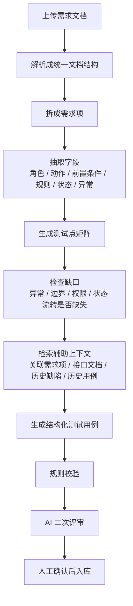
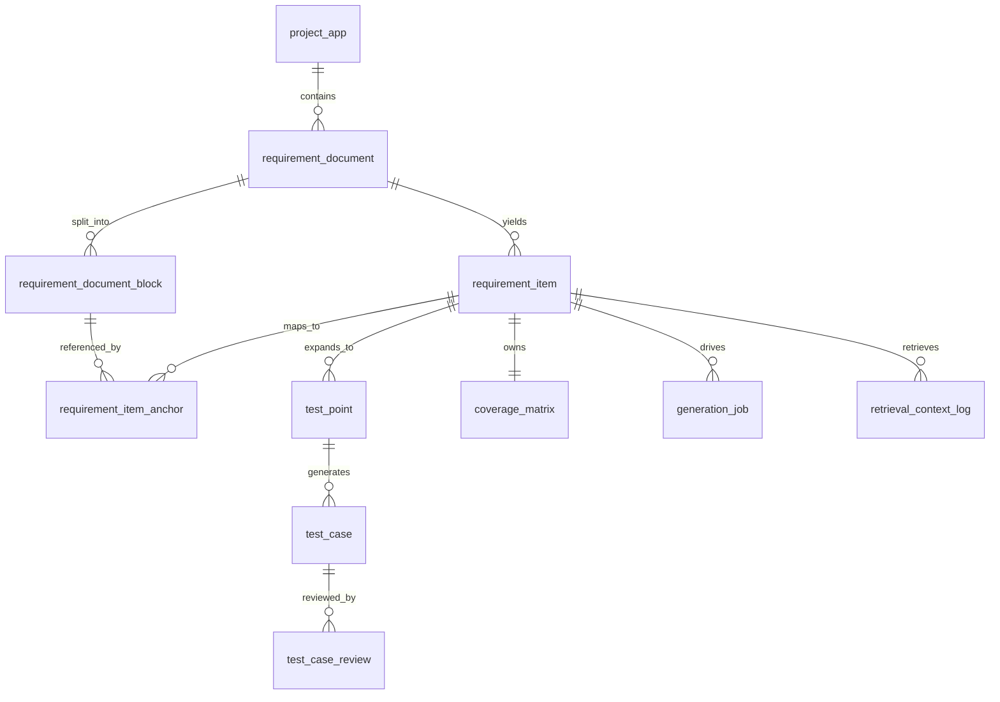
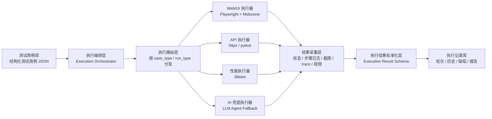
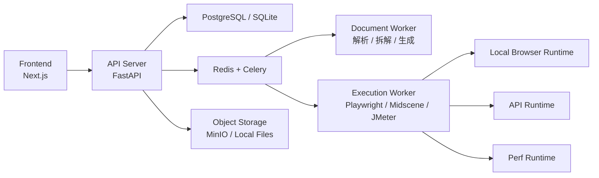
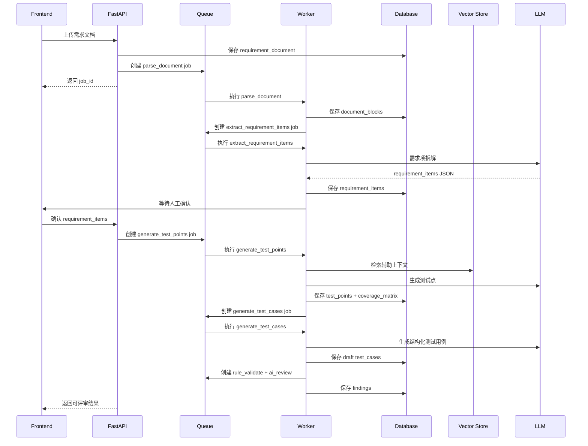
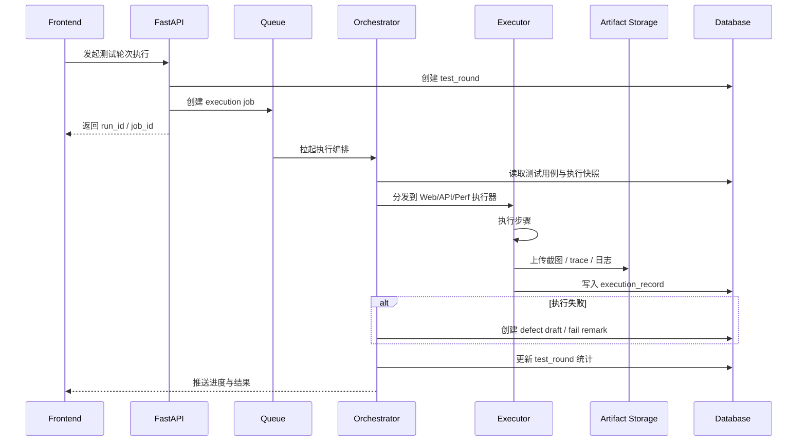
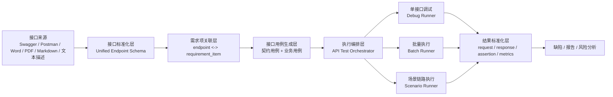
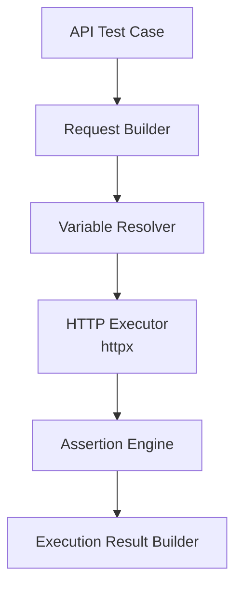
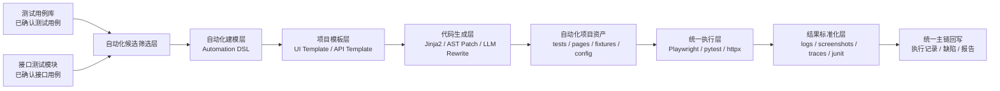

# AI 测试平台 — 技术实现方案（最终版）

> **文档状态**：Final
> **版本**：V2.0
> **日期**：2026-05-26
> **配套文档**：功能需求文档 V2.0（最终版）；架构方案 V1.0（历史参考）
> **核心目标**：以“需求文档 -> 需求项 -> 测试点 -> 测试用例 -> 执行 / 接口 / 自动化 / 性能 / 报告”为主链，构建可追溯、可执行、可扩展的 AI 测试平台

---

## 零、最终版技术基线

- **产品模式**：
  - 单用户、本地优先、AI 增强的测试工程效率平台
- **正式主链**：
  - `project_app -> requirement_document -> requirement_item -> test_point -> test_case -> execution / api / automation / performance / report`
- **最终版技术基线**：
  - 后端与编排：`Python + FastAPI + LangGraph + Celery/Redis`
  - 数据存储：`PostgreSQL + pgvector`，单机可降级 `SQLite + FTS5`
  - UI 自动化：`Python + Playwright`，必要时 `Midscene` 做视觉增强
  - 接口执行：`httpx / pytest-style assertion engine`
  - 性能执行：`JMeter CLI`
  - 实时反馈：`SSE + WebSocket`
- **最终版收敛原则**：
  - 先保证主链贯通，再做专项增强
  - 规则化、模板化、快照化优先于自由生成
  - `v1` 口径只保留迁移兼容意义，不再作为正式实现目标

## 一、核心技术难题分析

在开始详细设计之前，明确本项目需要解决的三个核心技术问题：

| 难题 | 描述 | 为什么难 |
|------|------|---------|
| **需求关联感知** | 同一需求库内的需求相互关联，AI生成用例时需要"看到"其他需求 | LLM 有 Token 限制，不能一次性塞入所有需求全文 |
| **用例完整生成** | AI 生成的用例要覆盖全面，不遗漏，不重复 | 单次 LLM 调用难以保证覆盖度，需要多轮补充 |
| **全链路数据贯通** | 需求→用例→执行→缺陷→报告，任意节点可正反向追溯 | 数据模型设计必须从一开始就把关联关系理清 |

---

## 二、数据库设计（推荐 PostgreSQL，兼容 SQLite 单机模式）

### 2.1 E-R 关系总览

```
project_app (项目 / 应用)
    │ 1:N
    ├── requirement_lib (需求库)
    │       │ 1:N
    │       ├── requirement_document (原始需求文档)
    │       │       │ 1:N
    │       │       ├── requirement_document_block (文档块 / 锚点)
    │       │       │ 1:N
    │       │       └── requirement_item (结构化需求项)
    │       │               │ 1:N
    │       │               ├── requirement_item_relation (需求项关系)
    │       │               │ 1:N
    │       │               ├── test_point (测试点)
    │       │               │       │ 1:N
    │       │               │       └── test_case (测试用例)
    │       │               │               │ 1:N
    │       │               │               ├── execution_record (执行记录)
    │       │               │               │       │ 0:1
    │       │               │               │       └── defect (缺陷)
    │       │               │               └── test_case_review (规则校验 / AI 评审)
    │       │               └── coverage_matrix (覆盖矩阵)
    │       └── requirement_brain (需求大脑分析结果)
    │
    ├── api_test_lib (接口测试库)
    │       ├── api_info (接口信息)
    │       ├── api_scenario (接口场景链路)
    │       └── api_environment (环境配置)
    │
    ├── auto_project (自动化项目)
    │       └── auto_case_file (自动化用例文件)
    │
    ├── perf_plan (性能测试方案)
    │       ├── perf_script (JMeter脚本)
    │       └── perf_result (性能执行结果)
    │
    └── report (报告)
```

### 2.2 核心表结构设计

#### 正式主链表结构（唯一正式口径）

> 注：为避免与下方“迁移兼容说明”中的历史表名重名，本小节示意性地给正式结构加了 `_v2` 标识；真正实施时应以本小节的字段关系和归属规则为准，不再新增旧 `requirement` 单表写入。

```sql
-- 项目 / 应用
CREATE TABLE project_app (
    id                  INTEGER PRIMARY KEY AUTOINCREMENT,
    code                TEXT NOT NULL UNIQUE,
    name                TEXT NOT NULL,
    description         TEXT,
    owner_name          TEXT,
    created_at          DATETIME DEFAULT CURRENT_TIMESTAMP,
    updated_at          DATETIME DEFAULT CURRENT_TIMESTAMP,
    is_deleted          INTEGER DEFAULT 0
);

-- 需求库
CREATE TABLE requirement_lib_v2 (
    id                  INTEGER PRIMARY KEY AUTOINCREMENT,
    project_id          INTEGER NOT NULL REFERENCES project_app(id),
    name                TEXT NOT NULL,
    description         TEXT,
    created_at          DATETIME DEFAULT CURRENT_TIMESTAMP,
    updated_at          DATETIME DEFAULT CURRENT_TIMESTAMP,
    is_deleted          INTEGER DEFAULT 0
);

-- 需求文档（原始输入载体）
CREATE TABLE requirement_document (
    id                  INTEGER PRIMARY KEY AUTOINCREMENT,
    project_id          INTEGER NOT NULL REFERENCES project_app(id),
    lib_id              INTEGER NOT NULL REFERENCES requirement_lib_v2(id),
    document_number     TEXT NOT NULL UNIQUE,
    name                TEXT NOT NULL,
    source_type         TEXT NOT NULL,                -- text/image/pdf/docx/xlsx/md/swagger/postman/har/curl
    source_file_name    TEXT,
    source_file_path    TEXT,
    raw_content         TEXT,
    parser_status       TEXT DEFAULT 'pending',       -- pending/parsing/parsed/confirmed/failed
    parser_metadata     TEXT,                         -- JSON
    version             INTEGER DEFAULT 1,
    created_at          DATETIME DEFAULT CURRENT_TIMESTAMP,
    updated_at          DATETIME DEFAULT CURRENT_TIMESTAMP,
    is_deleted          INTEGER DEFAULT 0
);

-- 文档块 / 原文锚点
CREATE TABLE requirement_document_block (
    id                  INTEGER PRIMARY KEY AUTOINCREMENT,
    document_id         INTEGER NOT NULL REFERENCES requirement_document(id),
    block_key           TEXT NOT NULL,
    block_type          TEXT NOT NULL,                -- paragraph/table/list/image/title/code
    raw_text            TEXT,
    normalized_text     TEXT,
    page_no             INTEGER,
    order_no            INTEGER NOT NULL,
    section_path        TEXT,
    metadata_json       TEXT,
    created_at          DATETIME DEFAULT CURRENT_TIMESTAMP
);

-- 结构化需求项
CREATE TABLE requirement_item (
    id                      INTEGER PRIMARY KEY AUTOINCREMENT,
    project_id              INTEGER NOT NULL REFERENCES project_app(id),
    lib_id                  INTEGER NOT NULL REFERENCES requirement_lib_v2(id),
    document_id             INTEGER NOT NULL REFERENCES requirement_document(id),
    item_number             TEXT NOT NULL,
    title                   TEXT NOT NULL,
    summary                 TEXT,
    module                  TEXT,
    actor                   TEXT,
    goal                    TEXT,
    preconditions_json      TEXT,
    business_rules_json     TEXT,
    state_transitions_json  TEXT,
    exceptions_json         TEXT,
    permissions_json        TEXT,
    non_functional_json     TEXT,
    priority                TEXT DEFAULT 'P2',
    status                  TEXT DEFAULT 'draft',     -- draft/confirmed/deferred/obsolete
    confidence              REAL DEFAULT 0.0,
    granularity_flag        TEXT DEFAULT 'normal',    -- normal/too_broad/too_fine/duplicate_suspected
    source_anchor_ids       TEXT,                     -- JSON array
    case_status             TEXT DEFAULT 'not_generated',
    version                 INTEGER DEFAULT 1,
    created_at              DATETIME DEFAULT CURRENT_TIMESTAMP,
    updated_at              DATETIME DEFAULT CURRENT_TIMESTAMP,
    is_deleted              INTEGER DEFAULT 0
);

-- 测试点
CREATE TABLE test_point (
    id                  INTEGER PRIMARY KEY AUTOINCREMENT,
    requirement_item_id INTEGER NOT NULL REFERENCES requirement_item(id),
    title               TEXT NOT NULL,
    point_type          TEXT NOT NULL,
    target              TEXT,
    priority            TEXT DEFAULT 'P2',
    suggested_method    TEXT,                         -- manual/api/automation/performance/compatibility
    coverage_status     TEXT DEFAULT 'todo',
    source_anchor_ids   TEXT,
    note                TEXT,
    created_at          DATETIME DEFAULT CURRENT_TIMESTAMP,
    updated_at          DATETIME DEFAULT CURRENT_TIMESTAMP,
    is_deleted          INTEGER DEFAULT 0
);

-- 测试用例
CREATE TABLE test_case_v2 (
    id                      INTEGER PRIMARY KEY AUTOINCREMENT,
    project_id              INTEGER NOT NULL REFERENCES project_app(id),
    lib_id                  INTEGER NOT NULL REFERENCES requirement_lib_v2(id),
    document_id             INTEGER REFERENCES requirement_document(id),
    requirement_item_id     INTEGER NOT NULL REFERENCES requirement_item(id),
    test_point_id           INTEGER REFERENCES test_point(id),
    case_number             TEXT NOT NULL UNIQUE,
    title                   TEXT NOT NULL,
    case_level              TEXT DEFAULT 'requirement_item',
    case_type               TEXT NOT NULL,
    precondition            TEXT,
    steps                   TEXT NOT NULL,
    expected_result         TEXT NOT NULL,
    priority                TEXT DEFAULT 'P2',
    tags                    TEXT,
    source_anchor_ids       TEXT,
    evidence_type           TEXT DEFAULT 'original',
    generation_reason       TEXT,
    status                  TEXT DEFAULT 'draft',
    directory_path          TEXT DEFAULT '/',
    sort_order              INTEGER DEFAULT 0,
    version                 INTEGER DEFAULT 1,
    created_at              DATETIME DEFAULT CURRENT_TIMESTAMP,
    updated_at              DATETIME DEFAULT CURRENT_TIMESTAMP,
    is_deleted              INTEGER DEFAULT 0
);

-- 执行记录
CREATE TABLE execution_record_v2 (
    id                      INTEGER PRIMARY KEY AUTOINCREMENT,
    project_id              INTEGER NOT NULL REFERENCES project_app(id),
    lib_id                  INTEGER REFERENCES requirement_lib_v2(id),
    document_id             INTEGER REFERENCES requirement_document(id),
    requirement_item_id     INTEGER REFERENCES requirement_item(id),
    case_id                 INTEGER NOT NULL REFERENCES test_case_v2(id),
    round_id                INTEGER,
    executor_type           TEXT NOT NULL,            -- manual/ui_auto/api_auto/perf_probe
    status                  TEXT NOT NULL,
    actual_result           TEXT,
    block_reason            TEXT,
    skip_reason             TEXT,
    pass_remark             TEXT,
    execution_time          INTEGER,
    ai_analysis             TEXT,
    request_snapshot        TEXT,
    response_snapshot       TEXT,
    artifact_summary_json   TEXT,
    executed_at             DATETIME DEFAULT CURRENT_TIMESTAMP
);

-- 接口测试库（项目级，优先绑定 requirement_item）
CREATE TABLE api_test_lib_v2 (
    id                      INTEGER PRIMARY KEY AUTOINCREMENT,
    project_id              INTEGER NOT NULL REFERENCES project_app(id),
    source_document_id      INTEGER REFERENCES requirement_document(id),
    name                    TEXT NOT NULL,
    description             TEXT,
    import_source           TEXT,
    latest_sync_at          DATETIME,
    created_at              DATETIME DEFAULT CURRENT_TIMESTAMP,
    updated_at              DATETIME DEFAULT CURRENT_TIMESTAMP,
    is_deleted              INTEGER DEFAULT 0
);

-- 自动化 / 性能 / 报告资产全部按项目归属
CREATE TABLE auto_project_v2 (
    id                      INTEGER PRIMARY KEY AUTOINCREMENT,
    project_id              INTEGER NOT NULL REFERENCES project_app(id),
    name                    TEXT NOT NULL,
    type                    TEXT NOT NULL,
    language                TEXT NOT NULL,
    framework               TEXT NOT NULL,
    extra_config            TEXT,
    created_at              DATETIME DEFAULT CURRENT_TIMESTAMP,
    updated_at              DATETIME DEFAULT CURRENT_TIMESTAMP,
    is_deleted              INTEGER DEFAULT 0
);

CREATE TABLE perf_plan_v2 (
    id                      INTEGER PRIMARY KEY AUTOINCREMENT,
    project_id              INTEGER NOT NULL REFERENCES project_app(id),
    source_document_id      INTEGER REFERENCES requirement_document(id),
    name                    TEXT NOT NULL,
    description             TEXT,
    requirement_item_ids_json TEXT,
    target_assets_json      TEXT,
    plan_content            TEXT,
    status                  TEXT DEFAULT 'draft',
    created_at              DATETIME DEFAULT CURRENT_TIMESTAMP,
    updated_at              DATETIME DEFAULT CURRENT_TIMESTAMP,
    is_deleted              INTEGER DEFAULT 0
);

CREATE TABLE report_v2 (
    id                      INTEGER PRIMARY KEY AUTOINCREMENT,
    project_id              INTEGER NOT NULL REFERENCES project_app(id),
    name                    TEXT NOT NULL,
    type                    TEXT NOT NULL,
    related_module          TEXT,
    related_scope_json      TEXT,
    requirement_item_ids_json TEXT,
    source_document_ids_json TEXT,
    content                 TEXT NOT NULL,
    created_at              DATETIME DEFAULT CURRENT_TIMESTAMP
);
```

#### 迁移兼容说明（历史 requirement 单表模型，仅迁移期参考）

> 下列 SQL 只用于说明历史 `requirement` 单表时期的数据形态与迁移映射。  
> 新功能、新接口和新页面一律以上面的正式主链结构为准，不再直接依赖这些旧表。

```sql
-- 需求库
CREATE TABLE requirement_lib (
    id              INTEGER PRIMARY KEY AUTOINCREMENT,
    name            TEXT NOT NULL,
    description     TEXT,
    created_at      DATETIME DEFAULT CURRENT_TIMESTAMP,
    updated_at      DATETIME DEFAULT CURRENT_TIMESTAMP,
    is_deleted      INTEGER DEFAULT 0
);

-- 需求
CREATE TABLE requirement (
    id              INTEGER PRIMARY KEY AUTOINCREMENT,
    lib_id          INTEGER NOT NULL REFERENCES requirement_lib(id),
    title           TEXT NOT NULL,                    -- AI提取的标题
    description     TEXT,                             -- AI提取的结构化描述
    raw_content     TEXT,                             -- 原始输入内容（文字）
    source_type     TEXT NOT NULL,                    -- 来源: text/image/document/batch
    priority        TEXT DEFAULT 'P2',                -- P0/P1/P2/P3
    case_status     TEXT DEFAULT 'not_generated',     -- not_generated/generated/requirement_changed
    sort_order      INTEGER DEFAULT 0,                -- 排序顺序（拖拽排序）
    version         INTEGER DEFAULT 1,                -- 当前版本号
    created_at      DATETIME DEFAULT CURRENT_TIMESTAMP,
    updated_at      DATETIME DEFAULT CURRENT_TIMESTAMP,
    is_deleted      INTEGER DEFAULT 0
);

-- 需求附件（图片/文档等原始文件）
CREATE TABLE requirement_attachment (
    id              INTEGER PRIMARY KEY AUTOINCREMENT,
    requirement_id  INTEGER NOT NULL REFERENCES requirement(id),
    file_name       TEXT NOT NULL,
    file_path       TEXT NOT NULL,                    -- 本地存储路径
    file_type       TEXT NOT NULL,                    -- image/pdf/docx/xlsx/txt/md
    file_size       INTEGER,                          -- 文件大小(bytes)
    created_at      DATETIME DEFAULT CURRENT_TIMESTAMP
);

-- 需求关联关系（需求大脑分析结果）
CREATE TABLE requirement_relation (
    id              INTEGER PRIMARY KEY AUTOINCREMENT,
    lib_id          INTEGER NOT NULL REFERENCES requirement_lib(id),
    source_req_id   INTEGER NOT NULL REFERENCES requirement(id),
    target_req_id   INTEGER NOT NULL REFERENCES requirement(id),
    relation_type   TEXT NOT NULL,                    -- dependency/association/conflict/overlap
    description     TEXT,                             -- AI分析的关系描述
    confidence      REAL DEFAULT 0.8,                 -- 置信度 0-1
    created_at      DATETIME DEFAULT CURRENT_TIMESTAMP
);

-- 需求大脑（整体分析结果）
CREATE TABLE requirement_brain (
    id              INTEGER PRIMARY KEY AUTOINCREMENT,
    lib_id          INTEGER NOT NULL REFERENCES requirement_lib(id),
    summary         TEXT,                             -- 需求总结
    relation_analysis TEXT,                           -- 关联分析文字
    risk_tips       TEXT,                             -- 风险提示（JSON数组）
    graph_data      TEXT,                             -- 关系图谱数据（JSON）
    analyzed_at     DATETIME DEFAULT CURRENT_TIMESTAMP,
    req_hash        TEXT                              -- 需求内容hash，判断是否需要重新分析
);

-- 需求变更日志
CREATE TABLE requirement_change_log (
    id              INTEGER PRIMARY KEY AUTOINCREMENT,
    requirement_id  INTEGER NOT NULL REFERENCES requirement(id),
    old_title       TEXT,
    new_title       TEXT,
    old_description TEXT,
    new_description TEXT,
    old_priority    TEXT,
    new_priority    TEXT,
    changed_at      DATETIME DEFAULT CURRENT_TIMESTAMP
);
```

#### 测试用例

```sql
-- 测试用例
CREATE TABLE test_case (
    id              INTEGER PRIMARY KEY AUTOINCREMENT,
    requirement_id  INTEGER NOT NULL REFERENCES requirement(id),
    lib_id          INTEGER NOT NULL REFERENCES requirement_lib(id),
    case_number     TEXT NOT NULL UNIQUE,              -- 用例编号 TC-XX-001-001
    title           TEXT NOT NULL,
    case_type       TEXT NOT NULL,                     -- functional/boundary/exception/compatibility/security/performance/usability
    precondition    TEXT,                              -- 前置条件
    steps           TEXT NOT NULL,                     -- 测试步骤（JSON数组）
    expected_result TEXT NOT NULL,                     -- 预期结果
    priority        TEXT DEFAULT 'P2',                 -- P0/P1/P2/P3
    tags            TEXT,                              -- 自定义标签（JSON数组）
    directory_path  TEXT DEFAULT '/',                  -- 目录路径
    sort_order      INTEGER DEFAULT 0,
    version         INTEGER DEFAULT 1,
    created_at      DATETIME DEFAULT CURRENT_TIMESTAMP,
    updated_at      DATETIME DEFAULT CURRENT_TIMESTAMP,
    is_deleted      INTEGER DEFAULT 0
);

-- 用例版本快照
CREATE TABLE test_case_version (
    id              INTEGER PRIMARY KEY AUTOINCREMENT,
    case_id         INTEGER NOT NULL REFERENCES test_case(id),
    version         INTEGER NOT NULL,
    change_type     TEXT NOT NULL,                     -- generated/reviewed/manual_edit/incremental
    snapshot        TEXT NOT NULL,                     -- 完整用例快照（JSON）
    change_summary  TEXT,                              -- 变更摘要
    created_at      DATETIME DEFAULT CURRENT_TIMESTAMP
);

-- 用例片段库
CREATE TABLE case_snippet (
    id              INTEGER PRIMARY KEY AUTOINCREMENT,
    name            TEXT NOT NULL,                     -- 片段名称
    category        TEXT,                              -- 分类
    content         TEXT NOT NULL,                     -- 片段内容（步骤文本）
    sort_order      INTEGER DEFAULT 0,
    created_at      DATETIME DEFAULT CURRENT_TIMESTAMP,
    updated_at      DATETIME DEFAULT CURRENT_TIMESTAMP
);

-- 用例生成预设方案
CREATE TABLE generation_preset (
    id              INTEGER PRIMARY KEY AUTOINCREMENT,
    name            TEXT NOT NULL,                     -- 方案名称（如"冒烟测试"）
    case_types      TEXT NOT NULL,                     -- 勾选的类型（JSON数组）
    granularity     TEXT DEFAULT 'standard',           -- simple/standard/detailed
    extra_prompt    TEXT,                              -- 额外补充说明
    created_at      DATETIME DEFAULT CURRENT_TIMESTAMP
);
```

#### 用例执行与缺陷

```sql
-- 测试轮次
CREATE TABLE test_round (
    id              INTEGER PRIMARY KEY AUTOINCREMENT,
    requirement_id  INTEGER NOT NULL REFERENCES requirement(id),
    name            TEXT NOT NULL,                     -- 轮次名称
    status          TEXT DEFAULT 'in_progress',        -- in_progress/completed
    total_count     INTEGER DEFAULT 0,
    pass_count      INTEGER DEFAULT 0,
    fail_count      INTEGER DEFAULT 0,
    block_count     INTEGER DEFAULT 0,
    skip_count      INTEGER DEFAULT 0,
    created_at      DATETIME DEFAULT CURRENT_TIMESTAMP,
    completed_at    DATETIME
);

-- 执行记录
CREATE TABLE execution_record (
    id              INTEGER PRIMARY KEY AUTOINCREMENT,
    case_id         INTEGER NOT NULL REFERENCES test_case(id),
    requirement_id  INTEGER NOT NULL REFERENCES requirement(id),
    round_id        INTEGER REFERENCES test_round(id), -- 可选关联轮次
    status          TEXT NOT NULL,                      -- not_executed/pass/fail/blocked/skipped
    actual_result   TEXT,                               -- 实际结果（失败时必填）
    block_reason    TEXT,                               -- 阻塞原因
    skip_reason     TEXT,                               -- 跳过原因
    pass_remark     TEXT,                               -- 通过备注（新增）
    execution_time  INTEGER,                            -- 执行耗时（秒）
    ai_analysis     TEXT,                               -- AI失败原因分析
    executed_at     DATETIME DEFAULT CURRENT_TIMESTAMP
);

-- 执行截图
CREATE TABLE execution_screenshot (
    id              INTEGER PRIMARY KEY AUTOINCREMENT,
    execution_id    INTEGER NOT NULL REFERENCES execution_record(id),
    file_path       TEXT NOT NULL,
    annotation_data TEXT,                               -- 标注数据（JSON，画框/箭头/文字坐标）
    created_at      DATETIME DEFAULT CURRENT_TIMESTAMP
);

-- 缺陷
CREATE TABLE defect (
    id              INTEGER PRIMARY KEY AUTOINCREMENT,
    defect_number   TEXT NOT NULL UNIQUE,               -- 缺陷编号 DEF-001
    execution_id    INTEGER NOT NULL REFERENCES execution_record(id),
    case_id         INTEGER NOT NULL REFERENCES test_case(id),
    requirement_id  INTEGER NOT NULL REFERENCES requirement(id),
    title           TEXT NOT NULL,                      -- 缺陷标题
    actual_result   TEXT,                               -- 实际结果（自动带入）
    severity        TEXT DEFAULT 'normal',              -- fatal/critical/normal/suggestion
    status          TEXT DEFAULT 'open',                -- open/fixed/wontfix
    remark          TEXT,
    created_at      DATETIME DEFAULT CURRENT_TIMESTAMP,
    updated_at      DATETIME DEFAULT CURRENT_TIMESTAMP
);
```

#### 接口测试

```sql
-- 接口测试库
CREATE TABLE api_test_lib (
    id              INTEGER PRIMARY KEY AUTOINCREMENT,
    name            TEXT NOT NULL,
    description     TEXT,
    created_at      DATETIME DEFAULT CURRENT_TIMESTAMP,
    updated_at      DATETIME DEFAULT CURRENT_TIMESTAMP,
    is_deleted      INTEGER DEFAULT 0
);

-- 接口分组
CREATE TABLE api_group (
    id              INTEGER PRIMARY KEY AUTOINCREMENT,
    lib_id          INTEGER NOT NULL REFERENCES api_test_lib(id),
    parent_id       INTEGER REFERENCES api_group(id),  -- 多级嵌套
    name            TEXT NOT NULL,
    sort_order      INTEGER DEFAULT 0
);

-- 接口信息
CREATE TABLE api_info (
    id              INTEGER PRIMARY KEY AUTOINCREMENT,
    lib_id          INTEGER NOT NULL REFERENCES api_test_lib(id),
    group_id        INTEGER REFERENCES api_group(id),
    name            TEXT NOT NULL,
    method          TEXT NOT NULL,                      -- GET/POST/PUT/DELETE/PATCH
    url             TEXT NOT NULL,
    headers_schema  TEXT,                               -- 请求头Schema（JSON）
    query_schema    TEXT,                               -- Query参数Schema（JSON）
    body_schema     TEXT,                               -- Body Schema（JSON）
    response_schema TEXT,                               -- 响应Schema（JSON）
    description     TEXT,
    sort_order      INTEGER DEFAULT 0,
    created_at      DATETIME DEFAULT CURRENT_TIMESTAMP,
    updated_at      DATETIME DEFAULT CURRENT_TIMESTAMP,
    is_deleted      INTEGER DEFAULT 0
);

-- 接口测试用例
CREATE TABLE api_test_case (
    id              INTEGER PRIMARY KEY AUTOINCREMENT,
    api_id          INTEGER NOT NULL REFERENCES api_info(id),
    lib_id          INTEGER NOT NULL REFERENCES api_test_lib(id),
    name            TEXT NOT NULL,
    category        TEXT,                               -- normal/param_missing/type_error/boundary/auth/idempotent
    request_headers TEXT,                               -- 完整请求头（JSON）
    request_query   TEXT,                               -- Query参数（JSON）
    request_body    TEXT,                               -- Body内容
    content_type    TEXT DEFAULT 'application/json',
    expected_status INTEGER,                            -- 预期状态码
    assertions      TEXT,                               -- 断言规则（JSON数组）
    pre_script      TEXT,                               -- 前置脚本（JS）
    post_script     TEXT,                               -- 后置脚本（JS）
    sort_order      INTEGER DEFAULT 0,
    created_at      DATETIME DEFAULT CURRENT_TIMESTAMP,
    updated_at      DATETIME DEFAULT CURRENT_TIMESTAMP
);

-- 环境配置
CREATE TABLE api_environment (
    id              INTEGER PRIMARY KEY AUTOINCREMENT,
    lib_id          INTEGER NOT NULL REFERENCES api_test_lib(id),
    name            TEXT NOT NULL,                      -- DEV/TEST/STAGING/PROD
    base_url        TEXT NOT NULL,
    headers         TEXT,                               -- 公共请求头（JSON）
    variables       TEXT,                               -- 环境变量（JSON: {key: value}）
    is_active       INTEGER DEFAULT 0,                  -- 是否当前激活
    sort_order      INTEGER DEFAULT 0
);

-- 接口场景链路
CREATE TABLE api_scenario (
    id              INTEGER PRIMARY KEY AUTOINCREMENT,
    lib_id          INTEGER NOT NULL REFERENCES api_test_lib(id),
    name            TEXT NOT NULL,
    description     TEXT,
    nodes           TEXT NOT NULL,                      -- 节点列表（JSON数组：接口ID+配置）
    edges           TEXT NOT NULL,                      -- 连线列表（JSON数组：源→目标+条件）
    data_mappings   TEXT,                               -- 数据传递映射（JSON）
    created_at      DATETIME DEFAULT CURRENT_TIMESTAMP,
    updated_at      DATETIME DEFAULT CURRENT_TIMESTAMP
);

-- 定时任务
CREATE TABLE api_schedule_task (
    id              INTEGER PRIMARY KEY AUTOINCREMENT,
    lib_id          INTEGER NOT NULL REFERENCES api_test_lib(id),
    name            TEXT NOT NULL,
    cron_expression TEXT NOT NULL,                      -- Cron表达式
    target_type     TEXT NOT NULL,                      -- api_cases/scenario
    target_ids      TEXT NOT NULL,                      -- 目标ID列表（JSON数组）
    is_enabled      INTEGER DEFAULT 1,
    last_run_at     DATETIME,
    last_result     TEXT,                               -- 上次执行结果摘要（JSON）
    created_at      DATETIME DEFAULT CURRENT_TIMESTAMP
);

-- 接口调试历史
CREATE TABLE api_debug_history (
    id              INTEGER PRIMARY KEY AUTOINCREMENT,
    api_id          INTEGER REFERENCES api_info(id),
    method          TEXT NOT NULL,
    url             TEXT NOT NULL,
    request_headers TEXT,
    request_body    TEXT,
    response_status INTEGER,
    response_headers TEXT,
    response_body   TEXT,
    response_time   INTEGER,                            -- 响应时间(ms)
    response_size   INTEGER,                            -- 响应大小(bytes)
    created_at      DATETIME DEFAULT CURRENT_TIMESTAMP
);
```

#### 自动化、性能测试、报告、系统

```sql
-- 自动化项目
CREATE TABLE auto_project (
    id              INTEGER PRIMARY KEY AUTOINCREMENT,
    name            TEXT NOT NULL,
    type            TEXT NOT NULL,                      -- ui/api
    language        TEXT NOT NULL,                      -- python/java/javascript
    framework       TEXT NOT NULL,                      -- playwright/selenium/cypress/pytest/junit/supertest
    extra_config    TEXT,                               -- 额外配置描述
    git_repo_url    TEXT,                               -- Git仓库地址
    git_auth        TEXT,                               -- Git认证信息（加密）
    framework_files TEXT,                               -- 框架文件结构（JSON）
    readme          TEXT,                               -- 说明文档
    created_at      DATETIME DEFAULT CURRENT_TIMESTAMP,
    updated_at      DATETIME DEFAULT CURRENT_TIMESTAMP,
    is_deleted      INTEGER DEFAULT 0
);

-- 自动化用例文件
CREATE TABLE auto_case_file (
    id              INTEGER PRIMARY KEY AUTOINCREMENT,
    project_id      INTEGER NOT NULL REFERENCES auto_project(id),
    file_name       TEXT NOT NULL,
    file_path       TEXT NOT NULL,                      -- 相对路径
    content         TEXT NOT NULL,                      -- 文件内容
    case_count      INTEGER DEFAULT 0,                  -- 用例方法数
    last_result     TEXT,                               -- 最近执行结果
    created_at      DATETIME DEFAULT CURRENT_TIMESTAMP,
    updated_at      DATETIME DEFAULT CURRENT_TIMESTAMP
);

-- 性能测试方案
CREATE TABLE perf_plan (
    id              INTEGER PRIMARY KEY AUTOINCREMENT,
    name            TEXT NOT NULL,
    description     TEXT,
    target_doc      TEXT,                               -- 上传的目标文档内容
    plan_content    TEXT,                               -- AI生成的方案内容（Markdown）
    jmx_script      TEXT,                               -- JMeter脚本XML
    status          TEXT DEFAULT 'draft',               -- draft/scripted/executed/reported
    created_at      DATETIME DEFAULT CURRENT_TIMESTAMP,
    updated_at      DATETIME DEFAULT CURRENT_TIMESTAMP,
    is_deleted      INTEGER DEFAULT 0
);

-- 性能测试结果
CREATE TABLE perf_result (
    id              INTEGER PRIMARY KEY AUTOINCREMENT,
    plan_id         INTEGER NOT NULL REFERENCES perf_plan(id),
    summary_data    TEXT NOT NULL,                      -- 汇总数据（JSON: avg/p50/p90/p95/p99/tps/error_rate）
    timeline_data   TEXT,                               -- 时序数据（JSON数组，用于绘图）
    error_details   TEXT,                               -- 错误详情（JSON数组）
    raw_data_path   TEXT,                               -- 原始CSV/JTL文件路径
    is_baseline     INTEGER DEFAULT 0,                  -- 是否为基线
    executed_at     DATETIME DEFAULT CURRENT_TIMESTAMP,
    duration        INTEGER                             -- 执行时长(秒)
);

-- 报告
CREATE TABLE report (
    id              INTEGER PRIMARY KEY AUTOINCREMENT,
    name            TEXT NOT NULL,
    type            TEXT NOT NULL,                      -- execution/api_test/automation/performance/comprehensive
    related_module  TEXT,                               -- 关联模块
    related_ids     TEXT,                               -- 关联ID列表（JSON）
    content         TEXT NOT NULL,                      -- 报告内容（Markdown）
    cover_info      TEXT,                               -- 封面信息（JSON）
    template_id     INTEGER REFERENCES report_template(id),
    created_at      DATETIME DEFAULT CURRENT_TIMESTAMP
);

-- 报告模板
CREATE TABLE report_template (
    id              INTEGER PRIMARY KEY AUTOINCREMENT,
    name            TEXT NOT NULL,
    sections        TEXT NOT NULL,                      -- 章节配置（JSON数组：标题+顺序+是否启用）
    is_default      INTEGER DEFAULT 0,
    created_at      DATETIME DEFAULT CURRENT_TIMESTAMP,
    updated_at      DATETIME DEFAULT CURRENT_TIMESTAMP
);

-- 报告素材（页面截图）
CREATE TABLE report_material (
    id              INTEGER PRIMARY KEY AUTOINCREMENT,
    name            TEXT,
    file_path       TEXT NOT NULL,
    source_page     TEXT,                               -- 来源页面
    created_at      DATETIME DEFAULT CURRENT_TIMESTAMP
);

-- LLM配置
CREATE TABLE llm_config (
    id              INTEGER PRIMARY KEY AUTOINCREMENT,
    name            TEXT NOT NULL,
    base_url        TEXT NOT NULL,
    api_key_encrypted TEXT NOT NULL,                    -- AES加密存储
    model_name      TEXT NOT NULL,
    max_tokens      INTEGER DEFAULT 4096,
    temperature     REAL DEFAULT 0.7,
    is_default      INTEGER DEFAULT 0,
    is_enabled      INTEGER DEFAULT 1,
    module_binding  TEXT,                               -- 模块绑定（JSON: {requirement: true, testcase: false, ...}）
    sort_order      INTEGER DEFAULT 0,
    created_at      DATETIME DEFAULT CURRENT_TIMESTAMP,
    updated_at      DATETIME DEFAULT CURRENT_TIMESTAMP
);

-- LLM用量统计
CREATE TABLE llm_usage (
    id              INTEGER PRIMARY KEY AUTOINCREMENT,
    config_id       INTEGER NOT NULL REFERENCES llm_config(id),
    module          TEXT NOT NULL,                      -- requirement/testcase/review/report/chat/...
    input_tokens    INTEGER NOT NULL,
    output_tokens   INTEGER NOT NULL,
    duration_ms     INTEGER,                            -- 耗时
    created_at      DATETIME DEFAULT CURRENT_TIMESTAMP
);

-- Prompt模板
CREATE TABLE prompt_template (
    id              INTEGER PRIMARY KEY AUTOINCREMENT,
    scene           TEXT NOT NULL UNIQUE,               -- 场景标识：req_parse/case_gen_functional/case_review/...
    name            TEXT NOT NULL,                      -- 显示名称
    content         TEXT NOT NULL,                      -- 模板内容
    variables       TEXT,                               -- 可用变量列表（JSON数组）
    is_builtin      INTEGER DEFAULT 1,                  -- 是否内置
    created_at      DATETIME DEFAULT CURRENT_TIMESTAMP,
    updated_at      DATETIME DEFAULT CURRENT_TIMESTAMP
);

-- 操作日志
CREATE TABLE operation_log (
    id              INTEGER PRIMARY KEY AUTOINCREMENT,
    module          TEXT NOT NULL,                      -- 模块名
    action          TEXT NOT NULL,                      -- create/update/delete/execute/generate
    target_type     TEXT,                               -- 操作对象类型
    target_id       INTEGER,                            -- 操作对象ID
    detail          TEXT,                               -- 操作详情
    created_at      DATETIME DEFAULT CURRENT_TIMESTAMP
);

-- 回收站
CREATE TABLE recycle_bin (
    id              INTEGER PRIMARY KEY AUTOINCREMENT,
    module          TEXT NOT NULL,                      -- 来源模块
    original_table  TEXT NOT NULL,                      -- 原始表名
    original_id     INTEGER NOT NULL,                   -- 原始ID
    data_snapshot   TEXT NOT NULL,                      -- 完整数据快照（JSON）
    deleted_at      DATETIME DEFAULT CURRENT_TIMESTAMP,
    expire_at       DATETIME                            -- 自动清理时间（30天后）
);

-- 用户偏好（继续上次位置、剪贴板历史等）
CREATE TABLE user_preference (
    id              INTEGER PRIMARY KEY AUTOINCREMENT,
    pref_key        TEXT NOT NULL UNIQUE,               -- 偏好键
    pref_value      TEXT NOT NULL,                      -- 偏好值（JSON）
    updated_at      DATETIME DEFAULT CURRENT_TIMESTAMP
);

-- 全文检索虚拟表
CREATE VIRTUAL TABLE fts_search USING fts5(
    module,         -- 模块名（requirement/testcase/api/...）
    ref_id,         -- 原始记录ID
    title,          -- 标题
    content,        -- 内容
    tokenize = 'unicode61'
);
```

### 2.3 关键索引设计

```sql
-- 正式主链索引
CREATE INDEX idx_requirement_document_project ON requirement_document(project_id);
CREATE INDEX idx_requirement_document_lib ON requirement_document(lib_id);
CREATE INDEX idx_requirement_document_status ON requirement_document(parser_status);
CREATE INDEX idx_requirement_block_document_order ON requirement_document_block(document_id, order_no);
CREATE INDEX idx_requirement_item_project ON requirement_item(project_id);
CREATE INDEX idx_requirement_item_document ON requirement_item(document_id);
CREATE INDEX idx_requirement_item_status_priority ON requirement_item(status, priority);
CREATE INDEX idx_test_point_requirement_item ON test_point(requirement_item_id);
CREATE INDEX idx_test_point_method_status ON test_point(suggested_method, coverage_status);
CREATE INDEX idx_test_case_requirement_item_v2 ON test_case_v2(requirement_item_id);
CREATE INDEX idx_test_case_test_point_v2 ON test_case_v2(test_point_id);
CREATE INDEX idx_test_case_type_v2 ON test_case_v2(case_type);
CREATE INDEX idx_test_case_number_v2 ON test_case_v2(case_number);
CREATE INDEX idx_execution_case_v2 ON execution_record_v2(case_id);
CREATE INDEX idx_execution_requirement_item_v2 ON execution_record_v2(requirement_item_id);
CREATE INDEX idx_execution_status_v2 ON execution_record_v2(status);

-- 项目级专项资产索引
CREATE INDEX idx_api_test_lib_project_v2 ON api_test_lib_v2(project_id);
CREATE INDEX idx_auto_project_project_v2 ON auto_project_v2(project_id);
CREATE INDEX idx_perf_plan_project_v2 ON perf_plan_v2(project_id);
CREATE INDEX idx_report_project_type_v2 ON report_v2(project_id, type);

-- 历史兼容模型索引（仅迁移期保留）
CREATE INDEX idx_requirement_lib_id ON requirement(lib_id);
CREATE INDEX idx_requirement_case_status ON requirement(lib_id, case_status);
CREATE INDEX idx_requirement_relation_lib ON requirement_relation(lib_id);
CREATE INDEX idx_test_case_requirement ON test_case(requirement_id);
CREATE INDEX idx_test_case_lib ON test_case(lib_id);
CREATE INDEX idx_execution_case ON execution_record(case_id);
CREATE INDEX idx_execution_requirement ON execution_record(requirement_id);
CREATE INDEX idx_execution_round ON execution_record(round_id);
CREATE INDEX idx_defect_requirement ON defect(requirement_id);
CREATE INDEX idx_api_info_lib ON api_info(lib_id);
CREATE INDEX idx_api_case_api ON api_test_case(api_id);
CREATE INDEX idx_api_debug_api ON api_debug_history(api_id);

-- 通用运行时索引
CREATE INDEX idx_operation_log_module ON operation_log(module);
CREATE INDEX idx_operation_log_time ON operation_log(created_at);
CREATE INDEX idx_llm_usage_config ON llm_usage(config_id);
CREATE INDEX idx_llm_usage_date ON llm_usage(created_at);
```

---

## 三、AI引擎实现方案（核心）

### 3.1 需求关联感知方案

**问题**：生成某条需求的用例时，AI 需要"知道"同库其他需求的内容，才能避免遗漏跨需求场景和重复用例。但 LLM 有 Token 上限，不能全文塞入。

**解决方案：三级上下文注入**

```
┌─ 上下文构建流程 ──────────────────────────────────────────┐
│                                                           │
│  Level 1：当前需求全文（必须完整）                           │
│  ┌───────────────────────────────────────────────┐       │
│  │ 需求标题 + 需求描述全文 + 优先级 + 附件摘要    │       │
│  └───────────────────────────────────────────────┘       │
│                                                           │
│  Level 2：关联需求摘要（智能压缩）                          │
│  ┌───────────────────────────────────────────────┐       │
│  │ 需求大脑分析出的关联需求 → 只注入标题+核心描述   │       │
│  │ 按关联强度排序，取 Top 10                       │       │
│  │ 每条摘要控制在 100 字以内                        │       │
│  └───────────────────────────────────────────────┘       │
│                                                           │
│  Level 3：全库需求概览（极度压缩）                          │
│  ┌───────────────────────────────────────────────┐       │
│  │ 需求大脑的总结文本（整个库的概况）                │       │
│  │ 所有需求的标题列表（每条一行）                    │       │
│  └───────────────────────────────────────────────┘       │
│                                                           │
│  + 已有用例摘要（避免重复）                                │
│  ┌───────────────────────────────────────────────┐       │
│  │ 当前需求已有的用例标题列表（如果是增量生成）       │       │
│  └───────────────────────────────────────────────┘       │
│                                                           │
│  + 用例片段库（保持一致性）                                │
│  ┌───────────────────────────────────────────────┐       │
│  │ 片段库中的公共步骤名称列表                       │       │
│  └───────────────────────────────────────────────┘       │
│                                                           │
└───────────────────────────────────────────────────────────┘
```

**Token 预算分配**（以 128K 上下文的模型为例）：

| 部分 | Token 预算 | 说明 |
|------|-----------|------|
| 系统 Prompt | ~2000 | 角色定义 + 输出格式要求 |
| 当前需求全文 | ~3000 | 完整内容，不压缩 |
| 关联需求摘要（Top 10） | ~2000 | 每条 ~200 token |
| 全库需求概览 | ~1000 | 标题列表 |
| 已有用例摘要 | ~1000 | 标题列表 |
| 片段库 | ~500 | 名称列表 |
| 用户补充说明 | ~500 | 自由文本 |
| **输入 Token 合计** | **~10000** | 约 10K |
| **输出 Token 预留** | **~20000** | 约 50 条用例的空间 |

**Context Builder 伪代码**：

```java
public class CaseGenerationContextBuilder {

    public String buildContext(Long requirementId, GenerationConfig config) {
        // 1. 获取当前需求全文
        Requirement currentReq = requirementService.getById(requirementId);

        // 2. 获取需求大脑分析结果
        RequirementBrain brain = brainService.getByLibId(currentReq.getLibId());

        // 3. 获取关联需求摘要（按关联强度排序，取Top 10）
        List<RequirementRelation> relations = relationService.getRelated(requirementId);
        List<RequirementSummary> relatedSummaries = relations.stream()
            .sorted(Comparator.comparingDouble(RequirementRelation::getConfidence).reversed())
            .limit(10)
            .map(r -> requirementService.getSummary(r.getTargetReqId()))
            .toList();

        // 4. 获取全库需求标题列表
        List<String> allTitles = requirementService.getAllTitles(currentReq.getLibId());

        // 5. 获取已有用例标题（避免重复）
        List<String> existingCaseTitles = testCaseService.getTitlesByRequirement(requirementId);

        // 6. 获取片段库
        List<CaseSnippet> snippets = snippetService.getAll();

        // 7. 渲染Prompt模板
        return promptTemplateEngine.render("case_generation", Map.of(
            "current_requirement", currentReq,
            "brain_summary", brain.getSummary(),
            "related_requirements", relatedSummaries,
            "all_requirement_titles", allTitles,
            "existing_case_titles", existingCaseTitles,
            "snippets", snippets,
            "case_types", config.getCaseTypes(),
            "granularity", config.getGranularity(),
            "user_supplement", config.getSupplement()
        ));
    }
}
```

### 3.2 AI 用例完整生成方案

#### 3.2.0 推荐优先实现方案（需求文档 -> 测试用例主链路）

> 本小节定义“需求文档转测试用例”的推荐优先实现方案。  
> 目标不是让模型一次性从整份需求文档直接输出全部最终用例，而是通过**结构化拆解、覆盖矩阵、混合检索、规则校验、AI 复核、人工确认**六层机制，最大化保证生成结果**贴合需求**且**尽量全面**。

##### 3.2.0.1 推荐技术栈

| 层 | 推荐技术 | 作用 |
|------|------|------|
| 文档上传与 API | FastAPI | 提供稳定的上传、任务查询、生成接口 |
| 工作流编排 | LangGraph | 编排“解析 -> 拆解 -> 检索 -> 生成 -> 校验 -> 复核 -> 人工确认”状态流 |
| 异步任务 | Redis + Celery | 承载文档解析、长时间生成、复核任务 |
| 主数据库 | PostgreSQL | 存业务数据、追溯关系、状态机数据 |
| 向量检索 | pgvector | 存需求项、历史用例、历史缺陷、接口文档等嵌入向量 |
| 对象存储 | MinIO / S3 | 存原始需求文档、截图、导出文件 |
| 文档解析 | Docling | 将 PDF / Word / Markdown / 表格统一解析为结构化文档 |
| 结构化输出 | OpenAI Structured Outputs(JSON Schema) | 约束需求项、测试点、测试用例输出格式 |
| OCR / 视觉理解 | 多模态模型 + OCR 兜底 | 处理原型图、截图、扫描件 |

> 如果平台必须坚持纯本地单机模式，可降级为 `SQLite + FTS5 + 本地文件存储`，但从生成效果、混合检索能力、扩展性来看，最佳方案仍然是 `PostgreSQL + pgvector`。

##### 3.2.0.2 总体架构图


##### 3.2.0.3 生成工作流图



##### 3.2.0.4 六层实现方案

**1. 文档解析层**

目标：把所有输入统一成可处理、可追溯的结构化文档对象。

实现要求：

- 使用 Docling 将 `PDF / Word / Markdown / 表格` 解析成统一结构
- 图片类需求优先走多模态模型；扫描件或复杂图像再走 OCR 兜底
- 解析结果必须保留：
  - 标题层级
  - 段落块
  - 表格
  - 图片说明
  - 页码或块级 ID
  - 原文锚点（anchor）

建议输出对象：

```json
{
  "document_id": "doc_001",
  "title": "订单模块需求说明",
  "sections": [],
  "blocks": [],
  "tables": [],
  "images": [],
  "anchors": []
}
```

**2. 需求项拆解层**

目标：把整份需求文档拆成**可测试的最小业务单元**，后续一切生成都以需求项为主上下文，而不是整份文档。

每条需求项至少抽取以下字段：

- `title`
- `module`
- `actor`
- `goal`
- `preconditions`
- `business_rules`
- `state_transitions`
- `exceptions`
- `permissions`
- `non_functional_constraints`
- `source_anchors`

强制要求：

- 需求项输出必须走 `JSON Schema` 约束
- 未确认的需求项不得直接进入最终用例生成
- 用户可对需求项做编辑、合并、删除、补充后再继续流程

**3. 混合检索层（RAG）**

RAG 在本项目中的定位：**上下文增强层**，不是质量保证层。

推荐索引内容：

- 需求项
- 需求项来源片段
- 历史测试点
- 历史测试用例
- 历史缺陷
- 接口文档
- 需求变更记录

推荐检索流程：

1. 元数据过滤
   - 当前项目
   - 当前需求库
   - 当前模块
   - 当前版本
2. 关键词/BM25 检索
3. 向量检索
4. rerank

关键原则：

- **当前需求项是唯一主上下文**
- RAG 仅作为辅助上下文
- 检索结果必须打标：
  - 原文明确
  - 关联需求项推断
  - 历史经验补充

**4. 覆盖规划层**

目标：不要让模型自由发挥“是否全面”，而是通过覆盖矩阵显式补洞。

默认覆盖维度：

- 功能点
- 主流程
- 异常流程
- 边界值
- 权限
- 数据状态
- 状态流转
- 兼容性
- 风险点
- 非功能要求

建议数据结构：

```json
{
  "requirement_item_id": "req_101",
  "coverage_matrix": {
    "functional": [],
    "happy_path": [],
    "negative": [],
    "boundary": [],
    "permission": [],
    "data_state": [],
    "state_transition": [],
    "compatibility": [],
    "risk": []
  }
}
```

规则：

- 先生成测试点，再生成完整用例
- 矩阵有明显缺口时，应先提示补测试点，而不是直接出最终用例

**5. 结构化测试用例生成层**

从测试点生成测试用例时，必须输出结构化对象，不允许只生成自然语言大段文本。

建议测试用例 schema：

```json
{
  "case_id": "",
  "requirement_item_id": "",
  "test_point_id": "",
  "title": "",
  "preconditions": [],
  "steps": [],
  "expected_results": [],
  "priority": "P0|P1|P2|P3",
  "case_type": "functional|boundary|negative|permission|compatibility",
  "source_anchors": [],
  "evidence_type": "original|inferred|historical",
  "generation_reason": ""
}
```

强制要求：

- 没有 `source_anchors` 的用例不得直接入库
- 每条用例必须知道：
  - 来自哪条需求项
  - 来自哪个测试点
  - 原文依据是什么
  - 是否存在 AI 推断成分

**6. 质量校验与人工确认层**

分为三步：

- **规则校验**
  - 是否缺前置条件
  - 是否步骤过粗
  - 是否预期结果不可验证
  - 是否重复
  - 是否某个覆盖维度完全为空
  - 是否高风险测试点无对应测试用例
- **AI 二次评审**
  - 是否遗漏场景
  - 是否优先级不合理
  - 是否与原文冲突
  - 是否应该拆分复合用例
- **人工确认**
  - 接受
  - 拒绝
  - 改写
  - 拆分
  - 补充异常场景
  - 补充边界场景
  - 补充权限场景

##### 3.2.0.5 关键实现原则

1. **需求库级理解负责看全局**
   - 用于依赖、冲突、回归、变更影响分析
2. **需求项级生成负责出结果**
   - 生成单条用例时，需求项是唯一主上下文
3. **RAG 负责补上下文**
   - 不负责单独保证准确性和全面性
4. **规则引擎负责兜底**
   - 用覆盖矩阵和校验规则保障下限
5. **人工确认负责最终质量**
   - 用户永远保留最终决定权

#### 3.2.1 数据模型补充设计

> 本小节是在现有数据库模型基础上，为“需求文档 -> 需求项 -> 测试点 -> 测试用例”主链路补充的核心数据结构。  
> 如果当前版本仍采用本地单机模式，可继续落在 SQLite；若后续升级为多端或团队版，建议无损迁移到 PostgreSQL + pgvector。

##### 3.2.1.1 新增核心实体

主链路新增或重构后的关键实体如下：

- `project_app`
  - 顶层项目 / 应用容器
- `requirement_document`
  - 原始上传材料，不等于最终需求
- `requirement_document_block`
  - 文档切片、段落、表格、图片说明等最小可引用块
- `requirement_item`
  - 从需求文档中拆出的结构化需求项
- `requirement_item_anchor`
  - 需求项与原文块的映射关系
- `test_point`
  - 按覆盖维度组织的测试点
- `coverage_matrix`
  - 需求项级覆盖矩阵
- `generation_job`
  - 解析、测试点生成、用例生成、复核等异步任务
- `retrieval_context_log`
  - RAG 检索到的辅助上下文记录
- `test_case_review`
  - 规则校验与 AI 评审结果

##### 3.2.1.1A 需求项建模规则

需求项是本项目最核心的业务中间层，建模时必须满足以下原则：

- **唯一测试意图原则**
  - 一条需求项应表达一个可独立测试的业务能力或规则
- **不过粗原则**
  - 不允许“整份文档一个需求项”
  - 不允许“一个页面全部功能一个需求项”
- **不过细原则**
  - 不把纯点击动作、纯字段输入动作拆成独立需求项
- **可追溯原则**
  - 每条需求项必须至少有一条 `source_anchor`
- **可版本化原则**
  - 每次编辑需求项都要保留版本递增和变更痕迹

##### 3.2.1.2 推荐关系图



##### 3.2.1.3 表结构补充建议

```sql
-- 顶层项目 / 应用
CREATE TABLE project_app (
    id              INTEGER PRIMARY KEY AUTOINCREMENT,
    name            TEXT NOT NULL,
    description     TEXT,
    created_at      DATETIME DEFAULT CURRENT_TIMESTAMP,
    updated_at      DATETIME DEFAULT CURRENT_TIMESTAMP,
    is_deleted      INTEGER DEFAULT 0
);

-- 原始需求文档
CREATE TABLE requirement_document (
    id              INTEGER PRIMARY KEY AUTOINCREMENT,
    project_id      INTEGER NOT NULL REFERENCES project_app(id),
    lib_id          INTEGER NOT NULL REFERENCES requirement_lib(id),
    title           TEXT NOT NULL,
    source_type     TEXT NOT NULL,      -- text/image/document/batch
    parse_status    TEXT DEFAULT 'pending',  -- pending/parsing/parsed/confirmed/failed
    summary         TEXT,
    raw_text        TEXT,
    version         INTEGER DEFAULT 1,
    created_at      DATETIME DEFAULT CURRENT_TIMESTAMP,
    updated_at      DATETIME DEFAULT CURRENT_TIMESTAMP,
    is_deleted      INTEGER DEFAULT 0
);

-- 文档块（段落/表格/图片说明）
CREATE TABLE requirement_document_block (
    id              INTEGER PRIMARY KEY AUTOINCREMENT,
    document_id     INTEGER NOT NULL REFERENCES requirement_document(id),
    block_type      TEXT NOT NULL,      -- heading/paragraph/table/image_caption/list
    section_path    TEXT,               -- 如 1.2.3
    page_no         INTEGER,
    block_index     INTEGER NOT NULL,
    content_text    TEXT,
    anchor_key      TEXT NOT NULL,      -- 供前后端追溯定位
    metadata_json   TEXT,
    created_at      DATETIME DEFAULT CURRENT_TIMESTAMP
);

-- 结构化需求项
CREATE TABLE requirement_item (
    id                      INTEGER PRIMARY KEY AUTOINCREMENT,
    project_id              INTEGER NOT NULL REFERENCES project_app(id),
    lib_id                  INTEGER NOT NULL REFERENCES requirement_lib(id),
    document_id             INTEGER NOT NULL REFERENCES requirement_document(id),
    title                   TEXT NOT NULL,
    module                  TEXT,
    actor                   TEXT,
    goal                    TEXT,
    preconditions_json      TEXT,
    business_rules_json     TEXT,
    state_transitions_json  TEXT,
    exceptions_json         TEXT,
    permissions_json        TEXT,
    non_functional_json     TEXT,
    status                  TEXT DEFAULT 'draft', -- draft/confirmed/deferred/obsolete
    confidence              REAL DEFAULT 0.0,
    granularity_flag        TEXT DEFAULT 'normal', -- normal/too_broad/too_fine/duplicate_suspected
    version                 INTEGER DEFAULT 1,
    created_at              DATETIME DEFAULT CURRENT_TIMESTAMP,
    updated_at              DATETIME DEFAULT CURRENT_TIMESTAMP,
    is_deleted              INTEGER DEFAULT 0
);

-- 需求项与原文锚点映射
CREATE TABLE requirement_item_anchor (
    id              INTEGER PRIMARY KEY AUTOINCREMENT,
    requirement_item_id INTEGER NOT NULL REFERENCES requirement_item(id),
    block_id        INTEGER NOT NULL REFERENCES requirement_document_block(id),
    quote_text      TEXT,
    evidence_type   TEXT NOT NULL,      -- original/inferred/historical
    created_at      DATETIME DEFAULT CURRENT_TIMESTAMP
);

-- 需求项关系
CREATE TABLE requirement_item_relation (
    id                      INTEGER PRIMARY KEY AUTOINCREMENT,
    source_requirement_item_id INTEGER NOT NULL REFERENCES requirement_item(id),
    target_requirement_item_id INTEGER NOT NULL REFERENCES requirement_item(id),
    relation_type           TEXT NOT NULL, -- dependency/association/conflict/overlap/duplicate
    description             TEXT,
    confidence              REAL DEFAULT 0.8,
    created_at              DATETIME DEFAULT CURRENT_TIMESTAMP
);

-- 需求项版本快照
CREATE TABLE requirement_item_version (
    id                      INTEGER PRIMARY KEY AUTOINCREMENT,
    requirement_item_id     INTEGER NOT NULL REFERENCES requirement_item(id),
    version                 INTEGER NOT NULL,
    snapshot_json           TEXT NOT NULL,
    change_summary          TEXT,
    created_at              DATETIME DEFAULT CURRENT_TIMESTAMP
);

-- 测试点
CREATE TABLE test_point (
    id                  INTEGER PRIMARY KEY AUTOINCREMENT,
    requirement_item_id INTEGER NOT NULL REFERENCES requirement_item(id),
    title               TEXT NOT NULL,
    point_type          TEXT NOT NULL,   -- functional/happy_path/negative/boundary/permission/data_state/state_transition/compatibility/risk
    target              TEXT,
    priority            TEXT DEFAULT 'P2',
    suggested_method    TEXT,            -- manual/api/automation/performance/compatibility
    coverage_status     TEXT DEFAULT 'todo', -- todo/in_scope/out_of_scope/confirmed
    source_anchor_ids   TEXT,            -- JSON array
    note                TEXT,
    created_at          DATETIME DEFAULT CURRENT_TIMESTAMP,
    updated_at          DATETIME DEFAULT CURRENT_TIMESTAMP,
    is_deleted          INTEGER DEFAULT 0
);

-- 覆盖矩阵
CREATE TABLE coverage_matrix (
    id                  INTEGER PRIMARY KEY AUTOINCREMENT,
    requirement_item_id INTEGER NOT NULL UNIQUE REFERENCES requirement_item(id),
    matrix_json         TEXT NOT NULL,
    gap_summary         TEXT,
    updated_at          DATETIME DEFAULT CURRENT_TIMESTAMP
);

-- 异步任务
CREATE TABLE generation_job (
    id                  INTEGER PRIMARY KEY AUTOINCREMENT,
    project_id          INTEGER NOT NULL REFERENCES project_app(id),
    document_id         INTEGER REFERENCES requirement_document(id),
    requirement_item_id INTEGER REFERENCES requirement_item(id),
    job_type            TEXT NOT NULL,   -- parse_document/extract_items/generate_points/generate_cases/rule_validate/ai_review
    status              TEXT DEFAULT 'pending', -- pending/running/succeeded/failed/cancelled
    progress            INTEGER DEFAULT 0,
    input_payload       TEXT,
    output_payload      TEXT,
    error_message       TEXT,
    created_at          DATETIME DEFAULT CURRENT_TIMESTAMP,
    updated_at          DATETIME DEFAULT CURRENT_TIMESTAMP
);

-- RAG 检索日志
CREATE TABLE retrieval_context_log (
    id                  INTEGER PRIMARY KEY AUTOINCREMENT,
    job_id              INTEGER NOT NULL REFERENCES generation_job(id),
    requirement_item_id INTEGER NOT NULL REFERENCES requirement_item(id),
    source_kind         TEXT NOT NULL,   -- requirement_item/document_block/test_case/defect/api_spec
    source_ref_id       INTEGER NOT NULL,
    score               REAL,
    evidence_type       TEXT NOT NULL,   -- original/related/historical
    created_at          DATETIME DEFAULT CURRENT_TIMESTAMP
);

-- 用例评审
CREATE TABLE test_case_review (
    id                  INTEGER PRIMARY KEY AUTOINCREMENT,
    case_id             INTEGER NOT NULL REFERENCES test_case(id),
    review_type         TEXT NOT NULL,   -- rule_check/ai_review/manual_review
    severity            TEXT,            -- critical/major/minor
    finding_title       TEXT,
    problem             TEXT,
    suggested_fix       TEXT,
    suggested_rewrite   TEXT,
    status              TEXT DEFAULT 'open', -- open/accepted/rejected/applied
    created_at          DATETIME DEFAULT CURRENT_TIMESTAMP
);
```

##### 3.2.1.4 现有表最少改造项

现有 `requirement`、`test_case`、`test_round`、`execution_record` 等表建议按以下方式最小改造：

- `requirement`
  - 从“最终需求实体”逐步迁移为“需求项兼容视图”或过渡表
- `test_case`
  - 增加：
    - `requirement_item_id`
    - `test_point_id`
    - `source_anchor_ids`
    - `evidence_type`
    - `generation_reason`
- `test_round`
  - 增加：
    - `project_id`
    - `requirement_item_id`
    - `document_id`（可空）
- `execution_record`
  - 增加：
    - `project_id`
    - `requirement_item_id`
    - `document_id`（可空）

##### 3.2.1.5 向量索引建议

若启用 pgvector，建议至少建立以下嵌入索引：

- `embedding_requirement_item`
- `embedding_document_block`
- `embedding_test_point`
- `embedding_test_case`
- `embedding_defect`
- `embedding_api_spec`

统一字段建议：

- `project_id`
- `source_kind`
- `source_ref_id`
- `content_text`
- `embedding`
- `metadata_json`
- `created_at`

##### 3.2.1.6 状态机建议

**需求文档状态**

- `pending`
- `parsing`
- `parsed`
- `confirmed`
- `failed`

**需求项状态**

- `draft`
- `confirmed`
- `deferred`
- `obsolete`

**需求项粒度标记**

- `normal`
- `too_broad`
- `too_fine`
- `duplicate_suspected`

##### 3.2.1.7 需求项拆分 / 合并规则

**自动标记为 `too_broad` 的典型条件**

- 一个需求项包含多个页面或模块
- 一个需求项同时包含多个独立角色目标
- 一个需求项同时描述主流程、后台配置、报表、通知等多个子系统能力

**自动标记为 `too_fine` 的典型条件**

- 仅描述单个点击动作
- 仅描述字段输入动作
- 不包含完整业务目的

**合并建议条件**

- 标题高度相似
- 来源片段高度重叠
- 业务规则基本一致

##### 3.2.1.8 需求项变更影响规则

当需求项变更时，系统至少应触发以下标记：

- 关联测试点 -> `待复核`
- 关联测试用例 -> `需求已变更`
- 关联接口资产 -> `可能受影响`
- 关联自动化资产 -> `可能受影响`
- 关联性能方案 -> `可能受影响`

变更影响日志至少记录：

- 旧版本号
- 新版本号
- 变更字段
- 影响范围摘要

**生成任务状态**

- `pending`
- `running`
- `succeeded`
- `failed`
- `cancelled`

**测试点覆盖状态**

- `todo`
- `in_scope`
- `out_of_scope`
- `confirmed`

#### 3.2.2 核心 API / 工作流节点设计

> 本小节描述“需求文档 -> 测试用例”主链路所需的核心接口和 LangGraph 工作流节点。  
> 原则：前端只面向**任务**和**结构化结果**交互，不直接拼装模型调用。

##### 3.2.2.1 核心 API 清单

**一、需求文档上传与解析**

```http
POST   /api/v2/projects/{projectId}/requirement-documents
GET    /api/v2/requirement-documents/{documentId}
POST   /api/v2/requirement-documents/{documentId}/parse
GET    /api/v2/requirement-documents/{documentId}/blocks
```

说明：

- 上传原始文档，返回 `document_id`
- 触发解析任务，返回 `job_id`
- 支持前端查看解析后的段落、表格、图片说明和锚点

**二、需求项拆解与确认**

```http
POST   /api/v2/requirement-documents/{documentId}/extract-items
GET    /api/v2/requirement-documents/{documentId}/requirement-items
PATCH  /api/v2/requirement-items/{itemId}
POST   /api/v2/requirement-items/{itemId}/confirm
POST   /api/v2/requirement-items/merge
DELETE /api/v2/requirement-items/{itemId}
```

说明：

- 将解析后的文档拆成需求项
- 支持编辑、确认、合并、删除
- 未确认需求项默认不进入最终用例生成链路

**三、测试点与覆盖矩阵**

```http
POST   /api/v2/requirement-items/{itemId}/generate-test-points
GET    /api/v2/requirement-items/{itemId}/test-points
PATCH  /api/v2/test-points/{testPointId}
GET    /api/v2/requirement-items/{itemId}/coverage-matrix
POST   /api/v2/requirement-items/{itemId}/refresh-coverage
```

说明：

- 测试点生成完成后自动刷新覆盖矩阵
- 前端可根据覆盖缺口提示用户补场景

**四、测试用例生成与评审**

```http
POST   /api/v2/requirement-items/{itemId}/generate-test-cases
GET    /api/v2/requirement-items/{itemId}/test-cases
POST   /api/v2/test-cases/rule-validate
POST   /api/v2/test-cases/ai-review
POST   /api/v2/test-cases/{caseId}/accept
PATCH  /api/v2/test-cases/{caseId}
DELETE /api/v2/test-cases/{caseId}
```

说明：

- 用例生成默认返回 `job_id`
- 规则校验和 AI 评审均以结构化 finding 输出
- 最终由用户确认或修改后入库

**五、任务与流式进度**

```http
GET    /api/v2/generation-jobs/{jobId}
GET    /api/v2/generation-jobs/{jobId}/events
POST   /api/v2/generation-jobs/{jobId}/cancel
```

说明：

- `events` 建议使用 SSE
- 前端统一通过 job 查询进度，不直接追模型状态

##### 3.2.2.2 关键接口输入输出示例

**1. 触发需求项拆解**

请求：

```json
{
  "parse_mode": "standard",
  "with_images": true,
  "with_tables": true
}
```

响应：

```json
{
  "job_id": "job_extract_items_001",
  "status": "pending"
}
```

**2. 需求项列表**

响应：

```json
{
  "document_id": "doc_001",
  "items": [
    {
      "id": "req_101",
      "title": "用户提交订单后系统生成待支付订单",
      "module": "订单",
      "status": "draft",
      "confidence": 0.91,
      "source_anchors": ["blk_21", "blk_22"]
    }
  ]
}
```

**3. 生成测试用例**

请求：

```json
{
  "generation_mode": "standard",
  "case_types": ["functional", "boundary", "negative"],
  "include_related_context": true,
  "include_historical_defects": true,
  "user_supplement": "重点关注优惠券叠加和库存状态"
}
```

响应：

```json
{
  "job_id": "job_generate_cases_001",
  "status": "pending"
}
```

##### 3.2.2.3 LangGraph 工作流节点设计

推荐将主链路建成状态图，每个节点只负责一件事。

**节点列表**

1. `load_document`
   - 输入：`document_id`
   - 输出：结构化文档对象

2. `parse_document`
   - 输入：原始文档
   - 输出：blocks / tables / anchors

3. `extract_requirement_items`
   - 输入：结构化文档
   - 输出：需求项草稿列表

4. `human_confirm_requirement_items`
   - 输入：需求项草稿
   - 输出：确认后的需求项

5. `retrieve_related_context`
   - 输入：当前需求项
   - 输出：关联需求项 / 历史缺陷 / 接口文档 / 历史用例

6. `generate_test_points`
   - 输入：需求项 + 辅助上下文
   - 输出：测试点列表

7. `build_coverage_matrix`
   - 输入：需求项 + 测试点
   - 输出：覆盖矩阵

8. `check_coverage_gap`
   - 输入：覆盖矩阵
   - 输出：缺口摘要

9. `generate_test_cases_batch`
   - 输入：需求项 + 测试点 + 检索上下文
   - 输出：结构化测试用例

10. `run_rule_validation`
    - 输入：测试用例
    - 输出：规则校验 findings

11. `run_ai_review`
    - 输入：测试用例 + 校验结果
    - 输出：AI review findings

12. `human_review_cases`
    - 输入：用例 + findings
    - 输出：用户确认后的用例

13. `persist_results`
    - 输入：最终用例、评审结果、日志
    - 输出：入库结果

##### 3.2.2.4 工作流状态对象建议

```json
{
  "project_id": "proj_001",
  "document_id": "doc_001",
  "requirement_item_id": "req_101",
  "document_blocks": [],
  "requirement_item": {},
  "retrieved_context": [],
  "test_points": [],
  "coverage_matrix": {},
  "coverage_gaps": [],
  "test_cases": [],
  "rule_findings": [],
  "ai_review_findings": [],
  "human_review_result": {},
  "job_id": "job_generate_cases_001"
}
```

##### 3.2.2.5 节点编排原则

- `load_document -> parse_document -> extract_requirement_items`
  - 文档级链路
- `human_confirm_requirement_items`
  - 人工闸门，必须存在
- `retrieve_related_context -> generate_test_points -> build_coverage_matrix -> check_coverage_gap`
  - 测试点规划链路
- `generate_test_cases_batch -> run_rule_validation -> run_ai_review`
  - 用例生成与质量校验链路
- `human_review_cases -> persist_results`
  - 最终入库链路

##### 3.2.2.6 进度事件建议

建议统一进度事件格式：

```json
{
  "job_id": "job_generate_cases_001",
  "step": "generate_test_points",
  "progress": 45,
  "message": "正在生成测试点并检查覆盖缺口"
}
```

典型步骤：

- 10% 文档解析完成
- 25% 需求项拆解完成
- 40% 测试点生成完成
- 55% 覆盖矩阵检查完成
- 75% 测试用例生成完成
- 90% 规则校验与 AI 复核完成
- 100% 等待人工确认 / 已入库

#### 3.2.3 Prompt / JSON Schema 设计

> 本小节定义主链路中最关键的 Prompt 设计原则和结构化输出 Schema。  
> 核心原则：**模型必须输出结构化对象，而不是自由文本；Prompt 负责约束任务边界，Schema 负责约束结果形状。**

##### 3.2.3.1 Prompt 设计总原则

每类任务都应遵守以下原则：

1. 明确角色
   - 例如：`你是一位资深测试工程师`
2. 明确输入对象
   - 当前需求项
   - 来源片段
   - 辅助上下文
3. 明确任务目标
   - 是拆解需求项、生成测试点，还是生成测试用例
4. 明确禁止事项
   - 不得脱离原文主语义
   - 不得输出无法验证的预期结果
   - 不得忽略高风险边界
5. 明确输出格式
   - 必须符合 JSON Schema
6. 明确证据规则
   - 每条结果必须带 `source_anchors` 或 `evidence_type`

##### 3.2.3.2 需求项拆解 Prompt

推荐输入上下文：

- 文档标题
- 文档分段结构
- 当前块内容
- 邻近块内容
- 表格摘要
- 图片说明（如有）

推荐 Prompt 模板：

```text
你是一位资深测试分析师。

任务：
请基于以下需求文档内容，拆解出结构化需求项。

要求：
1. 每条需求项必须是一个可独立测试的业务单元。
2. 不要把整份文档压缩成一条需求项。
3. 若原文没有明确表达，不要当成“原文明确”；只能标记为 inferred。
4. 输出必须符合给定 JSON Schema。

输出字段至少包括：
- title
- module
- actor
- goal
- preconditions
- business_rules
- state_transitions
- exceptions
- permissions
- non_functional_constraints
- source_anchors
- evidence_type
```

##### 3.2.3.3 测试点生成 Prompt

推荐输入上下文：

- 当前需求项结构化字段
- 来源原文片段
- 关联需求项摘要
- 历史缺陷摘要（可选）
- 接口文档摘要（可选）

推荐 Prompt 模板：

```text
你是一位资深测试设计专家。

任务：
请基于当前需求项，先生成测试点，而不是完整测试用例。

必须覆盖以下维度：
- functional
- happy_path
- negative
- boundary
- permission
- data_state
- state_transition
- compatibility
- risk

要求：
1. 每条测试点必须归属一个 coverage_type。
2. 每条测试点必须附带 source_anchors。
3. 若某条测试点主要来自关联需求或历史经验，应标记 evidence_type。
4. 不要输出冗余解释文字，只输出符合 JSON Schema 的对象数组。
```

##### 3.2.3.4 测试用例生成 Prompt

推荐输入上下文：

- 当前需求项
- 当前测试点集合
- 覆盖矩阵缺口摘要
- 检索到的辅助上下文
- 用户补充说明
- 已有用例标题（去重用）

推荐 Prompt 模板：

```text
你是一位资深测试工程师，请基于以下信息生成结构化测试用例。

主上下文：
- 当前需求项（唯一主上下文）

辅助上下文：
- 测试点列表
- 关联需求项摘要
- 历史缺陷摘要
- 接口文档摘要

生成要求：
1. 每条用例必须关联 requirement_item_id 和 test_point_id。
2. 每条用例必须有 preconditions、steps、expected_results。
3. expected_results 必须可验证，不能出现“显示正确”“流程正常”这类模糊描述。
4. 若内容来自 AI 推断，必须标记 evidence_type=inferred。
5. 没有 source_anchors 的结果视为不合格。
6. 输出必须符合 JSON Schema。
```

##### 3.2.3.5 AI 复核 Prompt

推荐输入上下文：

- 当前需求项
- 测试点矩阵
- 已生成测试用例
- 规则引擎 findings

推荐 Prompt 模板：

```text
你是一位测试用例评审专家。

任务：
请评审这组测试用例，检查：
- 是否遗漏测试场景
- 是否优先级不合理
- 是否与原文冲突
- 是否存在应拆分的复合用例

输出要求：
1. findings 按 critical / major / minor 分类
2. 每条 finding 说明 problem、why_it_matters、suggested_fix
3. 若问题足够明确，给出 suggested_rewrite
4. 输出必须符合 JSON Schema
```

##### 3.2.3.6 核心 JSON Schema 建议

**一、需求项 Schema**

```json
{
  "type": "object",
  "required": [
    "title",
    "module",
    "actor",
    "goal",
    "preconditions",
    "business_rules",
    "state_transitions",
    "exceptions",
    "permissions",
    "non_functional_constraints",
    "source_anchors",
    "evidence_type"
  ],
  "properties": {
    "title": { "type": "string" },
    "module": { "type": "string" },
    "actor": { "type": "string" },
    "goal": { "type": "string" },
    "preconditions": { "type": "array", "items": { "type": "string" } },
    "business_rules": { "type": "array", "items": { "type": "string" } },
    "state_transitions": { "type": "array", "items": { "type": "string" } },
    "exceptions": { "type": "array", "items": { "type": "string" } },
    "permissions": { "type": "array", "items": { "type": "string" } },
    "non_functional_constraints": { "type": "array", "items": { "type": "string" } },
    "source_anchors": { "type": "array", "items": { "type": "string" } },
    "evidence_type": { "type": "string", "enum": ["original", "inferred", "historical"] }
  }
}
```

**二、测试点 Schema**

```json
{
  "type": "object",
  "required": [
    "title",
    "coverage_type",
    "target",
    "priority",
    "suggested_method",
    "source_anchors",
    "evidence_type"
  ],
  "properties": {
    "title": { "type": "string" },
    "coverage_type": {
      "type": "string",
      "enum": [
        "functional",
        "happy_path",
        "negative",
        "boundary",
        "permission",
        "data_state",
        "state_transition",
        "compatibility",
        "risk"
      ]
    },
    "target": { "type": "string" },
    "priority": { "type": "string", "enum": ["P0", "P1", "P2", "P3"] },
    "suggested_method": { "type": "string", "enum": ["manual", "api", "automation", "performance", "compatibility"] },
    "source_anchors": { "type": "array", "items": { "type": "string" } },
    "evidence_type": { "type": "string", "enum": ["original", "inferred", "historical"] }
  }
}
```

**三、测试用例 Schema**

```json
{
  "type": "object",
  "required": [
    "requirement_item_id",
    "test_point_id",
    "title",
    "preconditions",
    "steps",
    "expected_results",
    "priority",
    "case_type",
    "source_anchors",
    "evidence_type",
    "generation_reason"
  ],
  "properties": {
    "requirement_item_id": { "type": "string" },
    "test_point_id": { "type": "string" },
    "title": { "type": "string" },
    "preconditions": { "type": "array", "items": { "type": "string" } },
    "steps": { "type": "array", "items": { "type": "string" } },
    "expected_results": { "type": "array", "items": { "type": "string" } },
    "priority": { "type": "string", "enum": ["P0", "P1", "P2", "P3"] },
    "case_type": { "type": "string", "enum": ["functional", "boundary", "negative", "permission", "compatibility"] },
    "source_anchors": { "type": "array", "items": { "type": "string" } },
    "evidence_type": { "type": "string", "enum": ["original", "inferred", "historical"] },
    "generation_reason": { "type": "string" }
  }
}
```

#### 3.2.4 规则校验引擎设计

> 规则校验引擎负责保证下限质量。  
> 原则：**凡是可以稳定规则化的检查，不交给 LLM。**

##### 3.2.4.1 规则引擎职责

规则引擎负责：

- 结构合法性检查
- 可执行性检查
- 预期结果可验证性检查
- 覆盖缺口检查
- 重复检测
- 优先级基本合理性检查

规则引擎不负责：

- 复杂业务语义理解
- 极细粒度测试设计创意
- 高级改写建议

##### 3.2.4.2 规则分类

**一、结构规则**

- 用例必须有标题
- 用例必须有关联需求项
- 用例必须有关联测试点
- `steps` 至少 1 条
- `expected_results` 至少 1 条
- `source_anchors` 不能为空

**二、可执行性规则**

- 前置条件为空但步骤中明显依赖登录、角色、数据时，标记问题
- 步骤中出现“进行测试”“检查一下”这类笼统描述时，标记问题
- 同一用例包含多个独立目标时，建议拆分

**三、预期结果规则**

- 出现以下模糊表达时标记问题：
  - 正常
  - 正确
  - 成功
  - 显示无误
  - 返回成功
- 预期结果必须至少包含一种可观察断言：
  - 页面提示
  - 状态变化
  - 字段变化
  - 返回码
  - 数据变化

**四、覆盖规则**

- `P0` 需求项必须至少有 1 条主流程用例
- `boundary` 测试点存在时，必须有边界类用例
- `negative` 测试点存在时，必须有异常类用例
- `permission` 测试点存在时，必须有权限类用例
- 高风险测试点不能全部无用例

**五、重复规则**

- 标题近似度超过阈值时标记疑似重复
- 步骤集合高度重叠时标记疑似重复
- 同一需求项下相同测试点生成多条语义接近用例时标记疑似冗余

**六、优先级规则**

- 涉及主流程、金额、权限、数据破坏、高风险状态流转的用例，默认不得低于 `P1`
- 仅体验或低影响兼容性细节的用例，不建议默认打成 `P0`

##### 3.2.4.3 规则执行时机

规则引擎至少在以下节点执行：

1. 测试点生成完成后
   - 检查覆盖矩阵是否缺口明显
2. 测试用例生成完成后
   - 运行完整规则校验
3. 人工编辑后再次提交前
   - 重新跑结构与可执行性规则
4. AI 评审前
   - 先把规则 findings 作为输入提供给 AI Reviewer

##### 3.2.4.4 Finding 结构建议

```json
{
  "severity": "critical|major|minor",
  "rule_code": "EXPECTED_RESULT_TOO_VAGUE",
  "target_type": "test_case",
  "target_id": "tc_1001",
  "title": "预期结果过于模糊",
  "problem": "存在“显示正确”这类无法直接验证的描述",
  "suggested_fix": "补充页面提示、状态变化或接口返回断言",
  "auto_fixable": false
}
```

##### 3.2.4.5 规则引擎实现建议

推荐实现方式：

- `Python` 独立模块
- 每条规则实现为单独 checker
- 汇总到统一 `RuleEngine`

示意：

```python
class RuleEngine:
    def run_case_checks(self, requirement_item, test_points, test_cases):
        findings = []
        findings.extend(self.check_structure(test_cases))
        findings.extend(self.check_executability(test_cases))
        findings.extend(self.check_expected_results(test_cases))
        findings.extend(self.check_coverage(requirement_item, test_points, test_cases))
        findings.extend(self.check_duplicates(test_cases))
        findings.extend(self.check_priority(test_cases))
        return findings
```

#### 3.2.5 前端交互与人工确认流设计

> 前端的重点不是“展示漂亮结果”，而是让用户在最小成本下完成：
> 1. 看懂 AI 是怎么生成的
> 2. 快速发现遗漏和错误
> 3. 高效接受、拒绝、改写、补充

##### 3.2.5.1 页面分步流

建议前端按以下步骤页组织：

1. **上传页**
   - 上传文档
   - 查看解析进度
2. **需求项确认页**
   - 编辑 / 合并 / 删除 / 补充需求项
3. **测试点确认页**
   - 查看测试点分组
   - 查看覆盖矩阵
   - 补充遗漏测试点
4. **测试用例生成页**
   - 查看结构化用例
   - 查看规则 findings
   - 查看 AI review 建议
5. **人工评审页**
   - 最终确认入库

##### 3.2.5.2 核心布局建议

**测试点确认页**

三栏布局：

- 左栏：需求项与原文片段
- 中栏：测试点列表
- 右栏：覆盖矩阵与缺口提示

**测试用例评审页**

三栏布局：

- 左栏：当前需求项 + 来源片段
- 中栏：生成用例列表
- 右栏：规则 findings + AI review

##### 3.2.5.3 需求项确认交互

用户可执行：

- 编辑标题
- 编辑描述
- 合并重复项
- 删除误拆项
- 手动新增遗漏项
- 标记“暂不入库”

交互要求：

- 每条需求项旁边显示 `confidence`
- 每条需求项可展开看 `source_anchors`
- 若为 AI 推断项，明显展示 `evidence_type`

##### 3.2.5.4 测试点确认交互

用户可执行：

- 按覆盖维度筛选
- 批量标记 `in_scope / out_of_scope`
- 补充缺失测试点
- 合并重复测试点

交互要求：

- 若 coverage matrix 某维度为空，页面顶部高亮提示
- 支持“一键补异常”“一键补边界”“一键补权限”

##### 3.2.5.5 用例评审交互

每条用例应展示：

- 标题
- 关联需求项
- 关联测试点
- `source_anchors`
- `evidence_type`
- 规则 findings 数量

用户操作：

- 接受用例
- 拒绝用例
- 手动改写
- 拆分用例
- 标记待补充

##### 3.2.5.6 Diff 评审交互

若 AI Review 给出改写建议，建议使用并排 diff：

- 左侧：当前版本
- 右侧：建议版本
- 底部：接受 / 拒绝 / 手动编辑

对单条 finding 提供：

- 问题说明
- 建议改法
- 改写后版本

##### 3.2.5.7 进度与状态交互

前端应统一订阅 `generation_job` 的 SSE 进度。

显示策略：

- 文档解析：10%
- 需求项拆解：25%
- 测试点生成：40%
- 覆盖矩阵检查：55%
- 测试用例生成：75%
- 规则校验 / AI 复核：90%
- 等待人工确认 / 已入库：100%

##### 3.2.5.8 人工确认后的结果处理

最终保存时应区分：

- `accepted`
- `edited`
- `split`
- `rejected`

并保留：

- 原始生成版本
- 修改后版本
- 操作日志
- 最终入库版本

**问题**：单次 LLM 调用可能遗漏场景。如何保证用例覆盖完整？

**解决方案：分阶段生成 + 自检补充**

```
┌─ 用例生成流水线（4步） ──────────────────────────────────┐
│                                                           │
│  Step 1：场景分析（Scene Analysis）                        │
│  ┌───────────────────────────────────────────────┐       │
│  │ Prompt: "分析这个需求，列出所有需要测试的场景点"   │       │
│  │ 输出: 场景列表（JSON数组）                        │       │
│  │ 作用: 先规划再执行，确保全面性                     │       │
│  └───────────────────────────────────────────────┘       │
│              ↓                                            │
│  Step 2：分批用例生成（Batch Generation）                  │
│  ┌───────────────────────────────────────────────┐       │
│  │ 按用例类型分批调用 LLM：                          │       │
│  │   ① 功能测试用例（基于场景列表）                   │       │
│  │   ② 边界值用例                                    │       │
│  │   ③ 异常/容错用例                                 │       │
│  │   ④ ...（用户勾选的类型）                          │       │
│  │ 每批独立调用，避免单次输出过长导致截断              │       │
│  └───────────────────────────────────────────────┘       │
│              ↓                                            │
│  Step 3：自检补充（Self-Review）                           │
│  ┌───────────────────────────────────────────────┐       │
│  │ Prompt: "检查已生成的用例列表，对照需求，               │
│  │         是否有遗漏的场景？是否有重复？"               │       │
│  │ 输出: 补充用例 + 去重建议                          │       │
│  │ 作用: AI 自我检查，弥补遗漏                        │       │
│  └───────────────────────────────────────────────┘       │
│              ↓                                            │
│  Step 4：质量评分（Quality Score）                         │
│  ┌───────────────────────────────────────────────┐       │
│  │ Prompt: "对这组用例从覆盖度、边界值、异常场景、      │       │
│  │         清晰度四个维度评分，给出改进建议"            │       │
│  │ 输出: 评分 + 建议                                  │       │
│  └───────────────────────────────────────────────┘       │
│                                                           │
└───────────────────────────────────────────────────────────┘
```

**流式进度反馈**：

```
前端进度展示：
[■■■□□□□□□□] 30%  正在分析需求场景...
[■■■■■□□□□□] 50%  正在生成功能测试用例（12条）...
[■■■■■■■□□□] 70%  正在生成边界值用例（5条）...
[■■■■■■■■□□] 80%  正在生成异常测试用例（8条）...
[■■■■■■■■■□] 90%  AI正在自检补充遗漏场景...
[■■■■■■■■■■] 100% 完成！共生成28条用例，质量评分85分
```

### 3.3 需求大脑实现方案

```
┌─ 需求大脑分析流程 ──────────────────────────────────────┐
│                                                          │
│  触发条件：需求新增/修改/删除 → 发布 RequirementChangedEvent │
│                                                          │
│  Step 1：收集所有需求                                     │
│  ┌──────────────────────────────────────────────┐       │
│  │ 查询当前需求库的所有需求标题 + 描述                │       │
│  │ 计算内容 Hash，与上次分析对比                      │       │
│  │ 如果 Hash 未变，跳过分析（避免重复消耗 Token）     │       │
│  └──────────────────────────────────────────────┘       │
│                                                          │
│  Step 2：AI 总结分析（单次调用）                          │
│  ┌──────────────────────────────────────────────┐       │
│  │ Prompt: 分析以下需求列表，生成：                    │       │
│  │   1. 整体需求总结（200字以内）                      │       │
│  │   2. 需求间关联关系（JSON格式）                     │       │
│  │   3. 风险提示（矛盾/遗漏/模糊点）                  │       │
│  └──────────────────────────────────────────────┘       │
│                                                          │
│  Step 3：保存分析结果                                     │
│  ┌──────────────────────────────────────────────┐       │
│  │ 更新 requirement_brain 表                       │       │
│  │ 更新 requirement_relation 表                    │       │
│  │ 更新内容 Hash                                    │       │
│  └──────────────────────────────────────────────┘       │
│                                                          │
│  Step 4：构建图谱数据                                     │
│  ┌──────────────────────────────────────────────┐       │
│  │ 将关联关系转换为前端图谱可用的 nodes + edges 格式  │       │
│  │ 存入 graph_data 字段                              │       │
│  └──────────────────────────────────────────────┘       │
│                                                          │
└──────────────────────────────────────────────────────────┘
```

### 3.4 AI 评审 Diff 实现方案

```
┌─ AI 评审流程 ────────────────────────────────────────────┐
│                                                           │
│  输入：当前需求 + 当前所有用例                              │
│                                                           │
│  Step 1：AI 评审生成建议                                   │
│  ┌───────────────────────────────────────────────┐       │
│  │ Prompt: "你是测试专家，评审以下用例集合：             │       │
│  │   - 需求内容：{{需求}}                                │       │
│  │   - 现有用例：{{用例JSON列表}}                        │       │
│  │   请检查覆盖完整性、冗余、清晰度，                    │       │
│  │   以JSON格式输出建议：                                │       │
│  │   {added: [...], deleted: [...],                      │       │
│  │    modified: [{id, changes, reason}]}"                │       │
│  └───────────────────────────────────────────────┘       │
│                                                           │
│  Step 2：生成 Diff 数据                                    │
│  ┌───────────────────────────────────────────────┐       │
│  │ 对比 AI 建议 vs 当前用例：                            │       │
│  │   - 新增：AI 建议新增的用例（绿色）                   │       │
│  │   - 删除：AI 建议删除的用例（红色）                   │       │
│  │   - 修改：AI 建议修改的字段（黄色高亮差异）           │       │
│  │   - 未变：无变更的用例（白色）                        │       │
│  │ 每条变更附带 AI 给出的理由                            │       │
│  └───────────────────────────────────────────────┘       │
│                                                           │
│  Step 3：用户确认                                          │
│  ┌───────────────────────────────────────────────┐       │
│  │ 前端 Diff 展示界面（左右分栏）                        │       │
│  │ 用户逐条 Accept / Reject                             │       │
│  │ 确认后应用变更，自动创建版本快照                      │       │
│  └───────────────────────────────────────────────┘       │
│                                                           │
└───────────────────────────────────────────────────────────┘
```

### 3.5 Prompt 模板设计

**用例生成 Prompt 示例**（功能测试维度）：

```
你是一位资深测试工程师，请基于以下需求信息生成功能测试用例。

## 当前需求
标题：{{current_requirement.title}}
描述：{{current_requirement.description}}
优先级：{{current_requirement.priority}}

## 需求库概况
{{brain_summary}}

## 关联需求（与当前需求有关系的）
{{#each related_requirements}}
- [{{this.title}}]（关系：{{this.relationType}}）：{{this.summary}}
{{/each}}

## 需求库完整需求标题列表
{{#each all_requirement_titles}}
{{@index}}. {{this}}
{{/each}}

## 已有用例（避免重复生成）
{{#each existing_case_titles}}
- {{this}}
{{/each}}

## 可用的公共测试步骤片段
{{#each snippets}}
- [{{this.name}}]：{{this.content}}
{{/each}}

## 用户补充说明
{{user_supplement}}

## 生成要求
- 粒度：{{granularity}}
- 覆盖当前需求的所有功能点，注意与关联需求的交叉场景
- 引用公共步骤片段时使用 [片段名称] 标记
- 每条用例包含：标题、前置条件、测试步骤（编号列表）、预期结果、优先级（P0-P3）
- 输出格式为 JSON 数组：
[
  {
    "title": "用例标题",
    "precondition": "前置条件",
    "steps": ["步骤1", "步骤2", "步骤3"],
    "expected_result": "预期结果",
    "priority": "P1"
  }
]
```

---

## 四、核心业务实现方案

### 4.1 全局搜索实现（FTS5）

```java
// 搜索服务实现
@Service
public class GlobalSearchService {

    // 搜索方法
    public SearchResult search(String keyword, int limit) {
        // 使用 FTS5 全文检索
        String sql = """
            SELECT module, ref_id, title,
                   snippet(fts_search, 3, '<mark>', '</mark>', '...', 20) as highlight
            FROM fts_search
            WHERE fts_search MATCH ?
            ORDER BY rank
            LIMIT ?
            """;

        List<SearchItem> items = jdbcTemplate.query(sql,
            new Object[]{keyword, limit}, searchItemRowMapper);

        // 按模块分组
        return SearchResult.groupByModule(items);
    }

    // 索引更新（事件驱动）
    @EventListener
    public void onRequirementChanged(RequirementChangedEvent event) {
        updateIndex("requirement", event.getId(),
            event.getTitle(), event.getDescription());
    }

    @EventListener
    public void onTestCaseChanged(TestCaseChangedEvent event) {
        updateIndex("testcase", event.getId(),
            event.getTitle(), event.getSteps());
    }
}
```

### 4.2 接口链路编排实现

```java
// 场景执行引擎
@Service
public class ScenarioExecutor {

    public ScenarioResult execute(ApiScenario scenario, ApiEnvironment env) {
        ScenarioResult result = new ScenarioResult();
        Map<String, Object> context = new HashMap<>();  // 变量上下文

        // 按拓扑排序执行节点
        List<ScenarioNode> sortedNodes = topologicalSort(scenario.getNodes(), scenario.getEdges());

        for (ScenarioNode node : sortedNodes) {
            // 1. 替换变量 {{varName}} → 从 context 中取值
            ApiRequest request = resolveVariables(node.getRequest(), context);

            // 2. 执行前置脚本
            if (node.getPreScript() != null) {
                scriptEngine.execute(node.getPreScript(), context);
            }

            // 3. 发送请求
            ApiResponse response = httpClient.execute(request, env);

            // 4. 执行后置脚本，提取变量
            if (node.getPostScript() != null) {
                scriptEngine.execute(node.getPostScript(), context, response);
            }

            // 5. 自动提取数据到上下文（按 data_mappings 配置）
            extractToContext(node.getDataMappings(), response, context);

            // 6. 记录结果
            result.addNodeResult(node.getId(), response);

            // 7. 条件分支判断
            ScenarioEdge nextEdge = evaluateCondition(node, response, scenario.getEdges());
            if (nextEdge != null && nextEdge.isAbortOnFail() && !response.isSuccess()) {
                result.setAborted(true);
                break;
            }
        }

        return result;
    }
}
```

### 4.3 定时任务实现

```java
// 基于 Spring Scheduler + 数据库配置的动态定时任务
@Service
public class ApiScheduleService {

    private final ScheduledTaskRegistrar taskRegistrar;
    private final Map<Long, ScheduledFuture<?>> runningTasks = new ConcurrentHashMap<>();

    // 启动时加载所有启用的任务
    @PostConstruct
    public void loadScheduledTasks() {
        List<ApiScheduleTask> tasks = taskMapper.selectEnabled();
        tasks.forEach(this::scheduleTask);
    }

    public void scheduleTask(ApiScheduleTask task) {
        CronTrigger trigger = new CronTrigger(task.getCronExpression());
        ScheduledFuture<?> future = taskScheduler.schedule(
            () -> executeScheduledTask(task), trigger);
        runningTasks.put(task.getId(), future);
    }

    private void executeScheduledTask(ApiScheduleTask task) {
        // 根据 target_type 执行对应的接口用例或场景
        if ("api_cases".equals(task.getTargetType())) {
            apiExecutionService.batchExecute(task.getTargetIdList());
        } else if ("scenario".equals(task.getTargetType())) {
            scenarioExecutor.execute(task.getTargetIdList());
        }

        // 生成简报
        String report = generateBriefReport(executionResult);
        task.setLastRunAt(LocalDateTime.now());
        task.setLastResult(report);
        taskMapper.updateById(task);
    }
}
```

### 4.4 Mock 服务实现

```java
// 内嵌 Mock HTTP 服务器
@Service
public class MockServerService {

    private HttpServer mockServer;
    private final Map<String, MockRule> mockRules = new ConcurrentHashMap<>();

    public void startMockServer(int port) {
        mockServer = HttpServer.create(new InetSocketAddress(port), 0);
        mockServer.createContext("/", this::handleMockRequest);
        mockServer.start();
    }

    private void handleMockRequest(HttpExchange exchange) {
        String path = exchange.getRequestURI().getPath();
        String method = exchange.getRequestMethod();
        String key = method + ":" + path;

        MockRule rule = mockRules.get(key);
        if (rule == null) {
            send404(exchange);
            return;
        }

        // 延迟响应
        if (rule.getDelay() > 0) {
            Thread.sleep(rule.getDelay());
        }

        // 条件响应匹配
        String responseBody = rule.matchCondition(exchange)
            ? rule.getConditionalResponse()
            : rule.getDefaultResponse();

        // 随机数据生成
        if (rule.isRandomData()) {
            responseBody = dataFactory.generateFromSchema(rule.getResponseSchema());
        }

        sendResponse(exchange, 200, responseBody);
    }
}
```

### 4.5 前后置脚本执行引擎

```java
// GraalVM JavaScript 脚本执行
@Service
public class ScriptEngine {

    public Object execute(String script, Map<String, Object> context, ApiResponse response) {
        try (Context jsContext = Context.newBuilder("js")
                .allowAllAccess(false)      // 安全沙箱
                .option("engine.WarnInterpreterOnly", "false")
                .build()) {

            // 注入上下文变量
            Value bindings = jsContext.getBindings("js");
            bindings.putMember("pm", createPmObject(context, response));
            bindings.putMember("console", createConsoleObject());

            // 执行脚本
            return jsContext.eval("js", script);
        }
    }

    // 创建类似 Postman 的 pm 对象
    private Object createPmObject(Map<String, Object> context, ApiResponse response) {
        return Map.of(
            "environment", Map.of(
                "get", (Function<String, Object>) context::get,
                "set", (BiConsumer<String, Object>) context::put
            ),
            "response", Map.of(
                "json", (Supplier<Object>) () -> parseJson(response.getBody()),
                "code", response.getStatusCode(),
                "responseTime", response.getTime()
            )
        );
    }
}
```

### 4.6 性能测试集成（JMeter）

```java
@Service
public class JMeterExecutionService {

    @Value("${app.jmeter.home}")
    private String jmeterHome;

    public PerfResult execute(String jmxScript, SseEmitter emitter) {
        // 1. 将 JMX 脚本写入临时文件
        Path jmxFile = Files.createTempFile("perf-", ".jmx");
        Files.writeString(jmxFile, jmxScript);

        // 2. 准备结果文件
        Path resultFile = Files.createTempFile("result-", ".jtl");

        // 3. 构建 JMeter 命令
        ProcessBuilder pb = new ProcessBuilder(
            jmeterHome + "/bin/jmeter",
            "-n",                              // 非GUI模式
            "-t", jmxFile.toString(),           // 测试脚本
            "-l", resultFile.toString(),        // 结果文件
            "-j", "/dev/null"                   // 抑制日志
        );

        // 4. 启动执行（虚拟线程，不阻塞主线程）
        Thread.startVirtualThread(() -> {
            Process process = pb.start();

            // 5. 实时读取输出，推送 SSE 事件
            try (BufferedReader reader = new BufferedReader(
                    new InputStreamReader(process.getInputStream()))) {
                String line;
                while ((line = reader.readLine()) != null) {
                    // 解析 JMeter 输出，提取实时指标
                    PerfMetric metric = parseJMeterOutput(line);
                    if (metric != null) {
                        emitter.send(SseEmitter.event()
                            .name("metric")
                            .data(metric));
                    }
                }
            }

            process.waitFor();

            // 6. 解析完整结果
            PerfResult result = parseJtlResult(resultFile);
            emitter.send(SseEmitter.event()
                .name("complete")
                .data(result));
            emitter.complete();
        });

        return null; // 结果通过 SSE 异步返回
    }
}
```

---

### 4.7 测试执行引擎最佳实现方案

> 本小节定义“测试用例生成之后，如何自动执行并返回结果、截图、日志和证据”的最佳实现架构。  
> 目标不是用单一技术解决所有执行问题，而是通过**统一执行编排层 + 多执行器架构**，同时兼顾稳定性、可解释性和扩展性。

#### 4.7.1 核心结论

推荐采用：

- `Web / UI 用例`：`Playwright + Midscene`
- `API 用例`：`httpx / pytest`
- `性能用例`：`JMeter`
- `AI` 仅承担：
  - 用例结构化转换
  - 元素定位增强
  - 失败原因分析
  - 兜底执行

原则：

- **确定性执行器负责跑**
- **AI 负责补充和兜底**
- **统一结果 schema 负责回传**

#### 4.7.2 总体架构图



#### 4.7.3 分层职责

**1. 用例表示层**

执行层不直接消费自然语言 Markdown，而是消费结构化测试用例对象。

最少字段：

- `case_id`
- `requirement_item_id`
- `case_type`
- `preconditions`
- `steps`
- `expected_results`
- `priority`

建议步骤结构：

```json
{
  "step_no": 1,
  "action": "click",
  "target": "登录按钮",
  "value": null,
  "assertions": []
}
```

**2. 执行编排层**

职责：

- 创建测试轮次
- 选择执行范围
- 分发给不同执行器
- 收集结果
- 更新状态
- 失败时触发缺陷记录或失败分析

推荐技术：

- `FastAPI`
- `Redis + Celery`
- `PostgreSQL`

**3. 执行路由层**

路由规则：

- `web_ui` -> `Playwright + Midscene`
- `api` -> `httpx / pytest`
- `performance` -> `JMeter`
- `unknown / low_structured` -> `AI fallback`

**4. 结果采集层**

统一采集：

- 步骤状态
- 步骤耗时
- 关键截图
- 失败截图
- trace
- 视频（可选）
- console log
- network log
- API request / response
- 性能汇总指标

#### 4.7.4 Web / UI 执行器方案

推荐组合：**Playwright + Midscene**

角色划分：

- `Playwright`
  - 浏览器生命周期
  - 登录态/session 管理
  - trace / video / network / console 采集
  - 稳定的原生交互和断言
- `Midscene`
  - 自然语言定位
  - 视觉交互
  - 视觉断言
  - 弱 DOM / 动态页面 / 复杂组件定位增强

执行模式建议：

**模式 A：确定性优先**

- 能映射成标准动作的步骤优先走 Playwright 原生：
  - `goto`
  - `fill`
  - `click`
  - `press`
  - `expect`

**模式 B：视觉增强**

- 难定位、弱语义、动态变化的元素交给 Midscene：
  - `aiTap`
  - `aiInput`
  - `aiAssert`
  - `aiWaitFor`

**模式 C：AI 兜底**

- 结构化映射失败时，允许走 `agent.aiAct()` 或等价 agent fallback
- 但不作为默认主路径

#### 4.7.5 API 执行器方案

推荐：

- `httpx`
- `pytest`
- JSON / schema / field assertion

职责：

- 发送请求
- 记录请求/响应
- 执行断言
- 输出差异说明

返回内容：

- request
- response
- status code
- latency
- assertion diff
- error stack

#### 4.7.6 性能执行器方案

推荐：

- `JMeter`

职责：

- 根据性能方案或脚本执行压测
- 返回：
  - 平均响应时间
  - P90 / P95 / P99
  - TPS
  - 错误率
  - 原始 JTL / CSV

#### 4.7.7 AI 在执行层的边界

AI 在执行层中应仅负责：

- 将自然语言用例步骤转成 DSL / JSON step
- 弱定位元素识别
- 失败后原因分析
- 无法结构化时的 fallback 执行

AI 不应单独负责：

- 所有主执行路径
- 稳定断言机制
- 最终执行结果真实性判断

#### 4.7.8 执行结果标准化 Schema

建议统一结果对象：

```json
{
  "run_id": "RUN-001",
  "case_id": "TC-001",
  "executor_type": "web_ui",
  "status": "failed",
  "started_at": "",
  "ended_at": "",
  "duration_ms": 15234,
  "steps": [
    {
      "step_no": 1,
      "action": "goto",
      "status": "passed",
      "duration_ms": 1200,
      "screenshot": "/artifacts/step1.png"
    },
    {
      "step_no": 2,
      "action": "click",
      "status": "failed",
      "duration_ms": 4000,
      "error": "locator not found",
      "screenshot": "/artifacts/step2_fail.png"
    }
  ],
  "artifacts": {
    "trace": "/artifacts/trace.zip",
    "video": "/artifacts/video.mp4",
    "console_log": "/artifacts/console.log"
  },
  "summary": {
    "passed_steps": 1,
    "failed_steps": 1
  }
}
```

#### 4.7.9 截图与证据采集策略

Web / UI 用例建议三档采集：

- `关键步骤截图`
  - 进入页面
  - 提交动作后
  - 结果页
- `失败自动截图`
  - 必须开启
- `调试模式全量截图`
  - 每一步都截

补充证据：

- Playwright trace
- 视频（可选）
- console log
- network log
- DOM 快照（可选）

API 用例证据：

- request
- response
- assertion diff
- latency
- 错误栈

性能用例证据：

- 汇总指标
- 场景级指标
- 原始 JTL / CSV
- 图表数据

#### 4.7.10 推荐的版本落地顺序

**第一阶段**

- 结构化测试用例
- Web/UI 执行器：`Playwright + Midscene`
- API 执行器：`httpx / pytest`
- 执行结果标准化
- 截图 / trace / 日志采集

**第二阶段**

- 自然语言步骤转 DSL
- 元素定位推荐
- 失败原因 AI 分析
- 报告自动生成

**第三阶段**

- AI Agent fallback
- 自愈执行
- 跨需求项回归推荐执行

#### 4.7.11 关键实现原则

1. **结构化用例是唯一主输入**
2. **Execution Orchestrator 统一编排**
3. **Playwright + Midscene 负责 Web/UI**
4. **httpx / pytest 负责 API**
5. **JMeter 负责性能**
6. **统一结果 schema 回传状态、截图、日志、trace**
7. **AI 只负责增强和兜底，不负责主执行稳定性**

### 4.8 执行器适配协议设计

> 本小节解决“AI 生成的结构化测试用例，如何稳定地映射到不同执行器”的问题。  
> 目标：让平台内部只维护一套 `Case DSL`，不同执行器只负责将 DSL 翻译为本地动作。

#### 4.8.1 统一 Case DSL

建议将测试用例步骤统一抽象为以下结构：

```json
{
  "step_no": 1,
  "action": "click",
  "target": "登录按钮",
  "target_type": "semantic",
  "value": null,
  "assertions": [],
  "timeout_ms": 5000,
  "retry_policy": "default"
}
```

核心字段说明：

- `action`
  - 执行动作，如 `goto / click / input / select / upload / assert / wait / api_request / perf_run`
- `target`
  - 动作对象，自然语言定位、URL、接口名、场景名等
- `target_type`
  - `semantic / selector / url / api / scenario`
- `value`
  - 输入值、上传文件、请求体等
- `assertions`
  - 附带断言
- `timeout_ms`
  - 步骤级超时
- `retry_policy`
  - 步骤级重试策略

#### 4.8.2 Action 枚举建议

**Web / UI**

- `goto`
- `click`
- `double_click`
- `hover`
- `input`
- `clear_input`
- `keyboard_press`
- `scroll`
- `upload_file`
- `assert_text`
- `assert_visible`
- `assert_url`
- `assert_count`
- `wait_for`
- `record_screenshot`

**API**

- `api_request`
- `assert_status_code`
- `assert_json_path`
- `assert_header`
- `extract_variable`

**性能**

- `perf_run`
- `assert_perf_threshold`

#### 4.8.3 执行器映射规则

| Case DSL Action | Web/UI 执行器 | API 执行器 | 性能执行器 |
|------|------|------|------|
| `goto` | Playwright | - | - |
| `click` | Playwright / Midscene | - | - |
| `input` | Playwright / Midscene | - | - |
| `assert_text` | Playwright / Midscene | - | - |
| `api_request` | - | httpx / pytest | - |
| `assert_status_code` | - | pytest assertion | - |
| `perf_run` | - | - | JMeter |

映射原则：

- **可确定定位的 UI 动作优先走 Playwright**
- **弱定位、动态定位、视觉判断优先走 Midscene**
- **接口类动作不经过浏览器**
- **性能类动作不经过 UI / API 执行器**

#### 4.8.4 Web/UI 动作选择策略

建议优先级：

1. `selector` 已知 -> Playwright 原生
2. `data-testid / role / text` 明确 -> Playwright 原生
3. 目标是自然语言描述、定位不稳定 -> Midscene `aiTap/aiInput/aiAssert`
4. 结构化失败或页面大幅变化 -> AI fallback

即：

`Playwright first -> Midscene second -> Agent fallback last`

#### 4.8.5 执行器适配器接口

建议后端定义统一适配器接口：

```python
class ExecutorAdapter(Protocol):
    def can_handle(self, case: dict) -> bool: ...
    def prepare(self, case: dict, context: dict) -> dict: ...
    def execute(self, case: dict, context: dict) -> dict: ...
    def collect_artifacts(self, result: dict) -> dict: ...
```

具体实现：

- `PlaywrightExecutorAdapter`
- `MidsceneExecutorAdapter`
- `ApiExecutorAdapter`
- `JMeterExecutorAdapter`
- `AgentFallbackExecutorAdapter`

#### 4.8.6 执行前编译步骤

执行前建议增加一个 `compile_case_for_runtime` 步骤：

职责：

- 解析变量引用
- 注入环境变量
- 注入测试账号
- 解析测试数据
- 为每一步补充默认超时与重试策略
- 生成运行时可执行对象

### 4.9 部署拓扑与运行模式

> 本项目既有“个人本地效率工具”的需求，又有 AI、浏览器执行、JMeter 等重执行能力。  
> 最佳方案不是纯浏览器端，而是**本地优先的混合执行架构**。

#### 4.9.1 推荐运行模式

推荐分两种模式：

**模式 A：本地优先（推荐默认）**

- 前端：本地桌面壳或本地 Web
- 后端：本机 FastAPI
- 执行器：本机 Playwright / Midscene / JMeter
- 数据库：本机 SQLite 或 PostgreSQL
- 优点：
  - 调试方便
  - 可直接访问浏览器、本地文件、账号态
  - 更适合个人测试工程师

**模式 B：服务端协同**

- 前端：浏览器
- AI 编排层：远程服务
- 本地执行代理：用户机器上的 Runner Agent
- 优点：
  - 更利于后续升级团队版
  - AI 生成和执行可分离

#### 4.9.2 推荐部署拓扑图



#### 4.9.3 本地执行代理建议

如果前端不是桌面壳，而是普通浏览器，建议增加本地执行代理：

- 名称：`runner-agent`
- 职责：
  - 拉取可执行任务
  - 启动本机浏览器
  - 管理本机文件上传
  - 运行 Playwright / Midscene / JMeter
  - 上传执行证据

#### 4.9.4 存储分层建议

- 业务数据：PostgreSQL / SQLite
- 向量数据：pgvector
- 原始文件：本地目录或 MinIO
- 执行产物：
  - 截图
  - trace
  - 视频
  - 日志
  - JTL / CSV

### 4.10 测试数据与账号注入方案

> 自动执行能不能稳定，很大程度上取决于测试账号、测试数据和环境变量注入是否有设计。

#### 4.10.1 核心对象

建议新增以下对象：

- `environment_profile`
  - 环境配置，如 baseUrl、headers、feature flags
- `credential_profile`
  - 测试账号或 token
- `test_data_set`
  - 可复用数据集
- `runtime_variable_snapshot`
  - 执行时变量快照

#### 4.10.2 注入优先级

推荐注入顺序：

1. 项目默认环境
2. 当前测试轮次环境
3. 当前用例显式变量
4. 当前步骤显式变量

即：

`step > case > round > project`

#### 4.10.3 执行时快照策略

每次执行都应保存以下快照：

- 项目
- 需求项
- 用例版本
- 环境
- 账号
- 数据集
- feature flags
- 执行时最终变量表

这样失败后才能复现。

#### 4.10.4 数据引用方式

在 Case DSL 中建议统一用变量引用：

```json
{
  "action": "input",
  "target": "用户名输入框",
  "value": "{{credential.username}}"
}
```

或：

```json
{
  "action": "api_request",
  "value": {
    "orderId": "{{testdata.order_id}}"
  }
}
```

### 4.11 执行失败恢复与重试策略

> 自动执行不是只关心“跑过了没有”，还要关心失败后系统怎样稳定处理。

#### 4.11.1 失败分类

建议统一失败分类：

- `assertion_failure`
- `locator_failure`
- `network_failure`
- `environment_failure`
- `data_failure`
- `runtime_failure`
- `timeout_failure`

#### 4.11.2 重试策略

| 失败类型 | 是否自动重试 | 默认次数 | 说明 |
|------|------|------|------|
| network_failure | 是 | 2 | 网络抖动可重试 |
| locator_failure | 视情况 | 1 | 可先切 Midscene 再重试 |
| timeout_failure | 是 | 1 | 适度延长等待 |
| assertion_failure | 否 | 0 | 业务断言失败不应直接重试 |
| data_failure | 否 | 0 | 应提示数据准备问题 |

#### 4.11.3 降级策略

Web / UI 执行推荐降级顺序：

1. Playwright 原生定位失败
2. 切换 Midscene 视觉定位
3. 若仍失败，进入 AI fallback
4. 若 fallback 仍失败，标记为执行失败并保留全部证据

#### 4.11.4 阻塞判断规则

以下情况更适合记为 `blocked` 而不是 `failed`：

- 环境不可访问
- 测试账号不可用
- 前置数据缺失
- 上游接口整体异常
- 需求未确认导致无法判断

### 4.12 安全与观测性设计

> 自动执行层必须从第一版开始定义好安全边界和可观测性，否则后续很难排障。

#### 4.12.1 安全边界

至少应定义：

- 凭据加密存储
- 本地文件路径白名单
- 上传目录隔离
- 浏览器上下文隔离
- 执行命令白名单
- JMeter / Playwright / Midscene 调用边界
- 敏感日志脱敏

#### 4.12.2 可观测性标识

建议统一以下 ID：

- `job_id`
- `run_id`
- `round_id`
- `case_id`
- `executor_run_id`
- `trace_id`

所有日志、截图、报告都应能按这些 ID 追踪。

#### 4.12.3 核心指标

建议至少采集：

- 用例执行成功率
- 首次执行通过率
- 重试后通过率
- 平均执行耗时
- 平均截图数量
- Midscene 调用占比
- fallback 触发率
- 执行失败分类分布

### 4.13 MVP 范围与实现优先级

> 本节用于约束第一版实现范围，防止执行层过度发散。

#### 4.13.1 V1 必做

- 结构化 Case DSL
- Execution Orchestrator
- Web/UI：Playwright + Midscene
- API：httpx / pytest
- 统一执行结果 schema
- 截图 / trace / 日志采集
- 测试轮次与执行快照

#### 4.13.2 V1 可后置

- AI fallback
- 视频录制
- 自愈定位
- 多浏览器矩阵
- 复杂云端分布式执行
- 执行智能调度

#### 4.13.3 V2 增强

- 自愈执行
- 失败自动分析
- 回归推荐执行集
- 多环境并行执行
- 远程 Runner Agent

---

### 4.14 数据迁移与兼容策略

> 本小节用于解决一个现实问题：当前方案已经从“需求库 -> requirement -> test_case”升级为“项目 / 应用 -> 需求文档 -> 需求项 -> 测试点 -> 测试用例”的主链路，现有表结构和旧接口需要可控迁移，而不是推倒重来。

#### 4.14.1 迁移原则

1. **不直接删除旧表**
   - 先新增新表和新字段
   - 用兼容层逐步切流
2. **读兼容优先**
   - 允许新旧数据同时存在
   - 读取逻辑优先读新模型，读不到再兼容旧模型
3. **写入双轨过渡**
   - 关键写入阶段可短期双写
4. **最终统一到新模型**
   - 待主链稳定后，再逐步废弃旧字段和旧接口

#### 4.14.2 需要迁移的旧对象

旧模型中的核心对象：

- `requirement_lib`
- `requirement`
- `requirement_attachment`
- `test_case`
- `test_round`
- `execution_record`
- `defect`

迁移目标：

- `requirement` -> `requirement_document + requirement_item`
- `test_case` -> 增强为显式关联 `requirement_item_id / test_point_id`
- `test_round / execution_record / defect` -> 增加 `project_id / requirement_item_id / document_id`

#### 4.14.3 推荐迁移阶段

**阶段 A：加表不切流**

- 新增：
  - `project_app`
  - `requirement_document`
  - `requirement_document_block`
  - `requirement_item`
  - `requirement_item_anchor`
  - `test_point`
  - `coverage_matrix`
  - `generation_job`
  - `retrieval_context_log`
  - `test_case_review`
- 旧接口不动

**阶段 B：文档链路切新**

- 新上传的需求全部走：
  - 文档解析
  - 需求项拆解
  - 测试点
  - 用例生成
- 旧数据仍只读兼容

**阶段 C：执行链路切新**

- 新生成用例必须带：
  - `project_id`
  - `requirement_item_id`
  - `test_point_id`
  - `source_anchor_ids`
- 执行、缺陷、报告优先走新主链

**阶段 D：历史数据回填**

- 编写离线迁移任务：
  - 将旧 `requirement` 转成默认 `requirement_document`
  - 再按“1 条旧 requirement -> 1 条 requirement_item”的最低保真策略回填
  - 旧 `test_case` 自动关联到回填后的 `requirement_item`

**阶段 E：废弃旧字段**

- 稳定后逐步废弃：
  - `requirement.raw_content` 作为主来源的地位
  - 仅按 `requirement_id` 追溯的逻辑

#### 4.14.4 历史数据最低保真策略

如果旧数据无法自动细拆，则采用保底策略：

- 每条旧 `requirement`
  - 生成 1 条 `requirement_document`
  - 生成 1 条 `requirement_item`
  - 原 `title / description / raw_content` 直接挂到该需求项
- 所有旧用例直接关联到该单条需求项

这样虽然不够精细，但能保证旧数据不丢。

#### 4.14.5 接口兼容策略

兼容规则建议如下：

- 旧接口保留：
  - `/api/v1/requirements/:id`
- 新接口新增：
  - `/api/v2/requirement-documents/:id`
  - `/api/v2/requirement-items/:id`

服务层做兼容转换：

- 旧页面调用 `requirement` 时
  - 若已迁移，映射到默认主 `requirement_item`
  - 若未迁移，读旧表

#### 4.14.6 报告与执行兼容

迁移期间，报告生成逻辑应支持两类来源：

- 新模型：
  - `project -> document -> item -> case -> execution`
- 旧模型：
  - `requirement -> case -> execution`

报告中明确标识：

- `需求项级关联`
- `历史兼容数据`

### 4.15 成本控制与缓存策略

> 本项目大量依赖 AI、多模态、检索和视觉执行，如果没有成本控制机制，后续一定会面临慢、贵、不稳定的问题。

#### 4.15.1 成本控制总原则

1. **把贵模型用在真正高价值节点**
2. **能规则化就不让模型做**
3. **能缓存就不重复生成**
4. **能局部重算就不全量重算**

#### 4.15.2 模型分层策略

建议按任务类型分层：

**高成本强模型**

- 需求项拆解
- 测试点规划
- AI Review
- 并排改写

**中成本模型**

- 测试用例生成
- 风险说明
- 报告总结

**低成本模型**

- 标题润色
- 分类打标
- 轻量问答

#### 4.15.3 缓存层设计

建议至少做 4 层缓存：

**1. 文档解析缓存**

- key: `document_hash + parser_version`
- 缓存：
  - blocks
  - tables
  - image captions

**2. 需求项拆解缓存**

- key: `document_hash + extraction_prompt_version + model_name`

**3. RAG 检索缓存**

- key: `requirement_item_id + retrieval_strategy_version`

**4. Midscene / UI 定位缓存**

- key: `page_signature + action_prompt + cacheId`
- 这里可以直接利用 Midscene 自带的 cache 能力

#### 4.15.4 局部重算策略

以下情况应只局部重算：

- 某个需求项改了
  - 只重算该需求项的测试点 / 用例 / review
- 新增一个历史缺陷
  - 只影响相关需求项的回归推荐
- 需求库摘要变更
  - 不自动重生所有用例

#### 4.15.5 执行层成本控制

Web / UI 执行层建议：

- 优先 Playwright 原生动作
- Midscene 只用于：
  - 难定位元素
  - 视觉断言
  - fallback
- 不默认每步都走 `aiAct()`

#### 4.15.6 Token / 调用保护

建议配置：

- 单任务最大 token 限制
- 单项目每日生成上限
- 图片解析大小限制
- 长文档自动分段解析
- 超长需求库分析走后台慢任务

#### 4.15.7 成本监控指标

建议记录：

- 每类任务调用次数
- 平均 token 消耗
- 平均耗时
- 缓存命中率
- Midscene 调用占比
- fallback 触发率

### 4.16 关键时序图

> 架构图解释“有什么”，时序图解释“怎么流动”。这里补两条最关键时序：生成链路和执行链路。

#### 4.16.1 需求文档 -> 测试用例生成时序图



#### 4.16.2 测试执行时序图



### 4.17 接口测试最佳实现方案

> 本节定义接口测试模块的推荐实现架构。  
> 目标不是“让 AI 读一遍 Swagger 就直接产出一堆用例”，而是通过**接口标准化、需求项关联、双层用例生成、统一执行引擎、标准结果沉淀**，构建稳定可扩展的接口测试能力。

#### 4.17.1 核心结论

推荐组合：

- **接口定义层**：`OpenAPI/Swagger Parser + Postman Parser + AI 文档提取`
- **标准模型层**：统一 `Endpoint Schema`
- **需求项关联层**：`endpoint <-> requirement_item`
- **用例生成层**：`规则模板 + LLM 增强生成`
- **执行层**：`httpx + pytest-style assertion engine`
- **场景链路层**：`Scenario Orchestrator`
- **环境层**：`Environment Profile + Secret Store`
- **结果层**：统一 `API Execution Result Schema`

原则：

- 契约类场景优先规则化
- 业务类场景由需求项驱动
- 调试与正式执行共用同一 runtime

#### 4.17.2 总体架构图



#### 4.17.3 接口标准化层

##### 4.17.3.1 设计目标

不管接口信息来自哪里，最终都必须转成同一套标准 `Endpoint Schema`，供后续：

- 快速调试
- 用例生成
- 场景链路编排
- 批量执行
- 报告沉淀

统一使用。

##### 4.17.3.2 输入来源

- Swagger / OpenAPI
- Postman Collection
- Word / PDF / Excel / Markdown
- 文本描述

##### 4.17.3.3 Endpoint Schema 建议

```json
{
  "endpoint_id": "ep_001",
  "service_name": "order-service",
  "module": "订单",
  "name": "创建订单",
  "method": "POST",
  "path": "/api/orders",
  "summary": "创建订单接口",
  "headers_schema": [],
  "query_schema": [],
  "path_schema": [],
  "body_schema": {},
  "response_schema": {},
  "auth_type": "bearer",
  "tags": ["订单", "创建"],
  "source_type": "openapi",
  "source_ref": "doc_001",
  "requirement_item_ids": ["req_101", "req_102"]
}
```

##### 4.17.3.4 实现建议

- OpenAPI：标准 parser
- Postman：JSON parser
- Word/PDF/Markdown/文本：AI 提取后转标准 schema
- 后续所有用例生成与执行逻辑不得直接消费“原始 Swagger 文本”

#### 4.17.4 需求项关联层

##### 4.17.4.1 关联关系

- 一个 endpoint 可以关联多个 requirement_item
- 一个 requirement_item 也可以关联多个 endpoint

##### 4.17.4.2 建议数据表

```sql
CREATE TABLE api_endpoint_requirement_item (
    id                  INTEGER PRIMARY KEY AUTOINCREMENT,
    endpoint_id         INTEGER NOT NULL REFERENCES api_info(id),
    requirement_item_id INTEGER NOT NULL REFERENCES requirement_item(id),
    relation_type       TEXT DEFAULT 'direct', -- direct/related/inferred
    created_at          DATETIME DEFAULT CURRENT_TIMESTAMP
);
```

##### 4.17.4.3 作用

- 支撑业务类接口用例生成
- 支撑需求变更影响分析
- 支撑接口结果回溯到需求项
- 支撑回归推荐

#### 4.17.5 接口用例生成层

##### 4.17.5.1 双层生成策略

推荐拆成两层：

**A. 契约类用例**

由接口 schema 和规则模板生成：

- 必填缺失
- 参数类型错误
- 边界值
- 非法枚举
- 鉴权失败
- 幂等性
- 状态码校验

**B. 业务类用例**

由 requirement_item + endpoint 关联生成：

- 正常业务流
- 状态流转
- 权限差异
- 数据状态变化
- 异常业务路径
- 回归场景

##### 4.17.5.2 为什么双层最好

- 契约类场景稳定、规则化程度高，规则引擎更准
- 业务类场景语义复杂，LLM 更有价值

##### 4.17.5.3 API Case Schema 建议

```json
{
  "case_id": "api_case_001",
  "endpoint_id": "ep_001",
  "requirement_item_ids": ["req_101"],
  "case_type": "contract|business",
  "title": "创建订单-缺少必填商品列表",
  "request": {
    "method": "POST",
    "path": "/api/orders",
    "headers": {},
    "query": {},
    "body": {}
  },
  "assertions": [
    { "type": "status_code", "op": "eq", "value": 400 },
    { "type": "json_path", "path": "$.message", "op": "contains", "value": "商品列表不能为空" }
  ],
  "priority": "P1"
}
```

#### 4.17.6 统一执行引擎

##### 4.17.6.1 最佳执行技术

推荐：

- `httpx`
- `pytest-style assertions`
- `asyncio` 批量并发

##### 4.17.6.2 执行链路图



##### 4.17.6.3 核心组件职责

**Request Builder**

- 拼 method / url / path / query / headers / body

**Variable Resolver**

- 注入环境变量
- 注入 token / credential
- 注入上一步提取值

**HTTP Executor**

- 发送请求
- 收集响应

**Assertion Engine**

- 状态码断言
- Header 断言
- JSONPath / JMESPath 断言
- schema 断言
- 正则断言
- 延时断言

**Execution Result Builder**

- 统一格式回传结果

#### 4.17.7 调试与正式执行统一 Runtime

最佳原则：

- 快速调试不是另一套系统
- 正式执行也不是另一套系统
- 两者共用：
  - Request Builder
  - Variable Resolver
  - Assertion Engine
  - Execution Result Builder

区别只在：

- 调试：单条即时执行
- 正式执行：批量 / 场景 / 轮次执行

#### 4.17.8 场景链路执行

##### 4.17.8.1 适用场景

- 注册 -> 登录 -> 下单 -> 支付 -> 查询订单
- 创建数据 -> 更新数据 -> 删除数据 -> 查询为空

##### 4.17.8.2 最佳实现

自研 `Scenario Orchestrator`

支持：

- 节点顺序执行
- 变量提取传递
- 条件分支
- 前后置脚本
- 失败中断 / 继续策略

##### 4.17.8.3 场景节点结构

```json
{
  "node_id": "step_1",
  "endpoint_id": "ep_001",
  "extract": [
    { "from": "$.data.id", "to": "order_id" }
  ],
  "use_variables": ["order_id"],
  "on_failure": "abort"
}
```

#### 4.17.9 环境与变量管理

##### 4.17.9.1 核心对象

- `environment_profile`
- `credential_profile`
- `runtime_variable_snapshot`

##### 4.17.9.2 优先级

推荐：

`step > case > scenario > environment > project`

##### 4.17.9.3 Secret 规则

- token / key 加密存储
- UI 脱敏展示
- 执行时解密注入
- 不进入日志明文

#### 4.17.10 执行结果标准化

##### 4.17.10.1 Result Schema

```json
{
  "run_id": "api_run_001",
  "case_id": "api_case_001",
  "endpoint_id": "ep_001",
  "status": "failed",
  "request": {
    "method": "POST",
    "url": "https://api.xxx.com/orders",
    "headers": {},
    "body": {}
  },
  "response": {
    "status_code": 500,
    "headers": {},
    "body": {}
  },
  "assertions": [
    {
      "rule": "status_code == 200",
      "status": "failed",
      "actual": 500
    }
  ],
  "duration_ms": 245,
  "trace_id": "trace_001"
}
```

##### 4.17.10.2 结果作用

统一结果对象供以下模块复用：

- 缺陷自动创建
- 报告聚合
- 回归推荐
- AI 失败分析

#### 4.17.11 推荐实现顺序

**第一阶段**

- Swagger / Postman 标准导入
- Unified Endpoint Schema
- endpoint 关联 requirement_item
- 契约类接口用例生成
- 单接口快速调试
- 批量执行
- 标准结果回传

**第二阶段**

- 文本 / Word / PDF 接口文档 AI 提取
- 业务类接口用例生成
- 场景链路执行
- 失败原因 AI 分析
- 回归推荐

#### 4.17.12 关键实现原则

1. **接口文档标准化先于 AI 生成**
2. **需求项关联先于业务用例生成**
3. **契约类用例优先规则化**
4. **业务类用例由 requirement_item 驱动**
5. **快速调试与正式执行共用同一 runtime**
6. **统一结果 schema 供缺陷、报告、回归复用**

### 4.18 自动化中心最佳技术实现方案

> 本节对应产品需求文档中的“七、自动化中心”。  
> 自动化中心不应被实现为一条脱离主链的独立产品线，而应作为：
> `已确认测试用例 -> 自动化候选筛选 -> 自动化代码生成 -> 自动化执行 -> 结果回归主链`
> 的扩展能力。

#### 4.18.1 核心结论

自动化中心最佳实现方案推荐如下：

- **输入源优先级**
  - 优先消费：测试用例库中的已确认测试用例
  - 次优先：接口测试模块中的已确认接口用例
  - 最后兜底：需求文档 / 外部文档直接生成
- **V1 技术栈收敛**
  - UI 自动化：`Python + Playwright`
  - 接口自动化：`Python + pytest + httpx`
- **代码生成策略**
  - 采用“项目模板 + Case DSL -> Automation DSL -> 代码渲染”的方式
  - 不采用“完全从零自由生成整套框架”作为默认主实现
- **执行结果归一**
  - 自动化执行结果必须回归：
    - `test_round`
    - `execution_record`
    - `defect`
    - `report`

#### 4.18.2 总体架构图



#### 4.18.3 自动化候选筛选层

##### 4.18.3.1 设计目标

不要对所有测试用例直接自动化。  
应先判断“是否值得自动化”和“适合哪类自动化”。

##### 4.18.3.2 候选分类

- `recommended`
  - 高频执行
  - 主流程
  - 回归关键路径
  - 断言明确
  - 页面或接口较稳定
- `optional`
  - 有一定价值，但依赖较多或波动较大
- `not_recommended`
  - 探索性强
  - 依赖人工判断
  - 视觉/交互波动过大
  - 成本远高于收益

##### 4.18.3.3 建议输出对象

```json
{
  "source_case_id": "TC-001",
  "automation_recommendation": "recommended",
  "automation_type": "ui|api|hybrid",
  "reason": [
    "主流程",
    "高频回归",
    "断言明确"
  ],
  "priority": "P0"
}
```

#### 4.18.4 自动化建模层

##### 4.18.4.1 设计目标

不要直接把自然语言测试用例喂给代码生成器。  
应先转成统一的 `Automation DSL`。

##### 4.18.4.2 UI Automation DSL 示例

```json
{
  "case_id": "TC-001",
  "type": "ui",
  "steps": [
    { "action": "goto", "target": "/login" },
    { "action": "input", "target": "用户名输入框", "value": "{{credential.username}}" },
    { "action": "input", "target": "密码输入框", "value": "{{credential.password}}" },
    { "action": "click", "target": "登录按钮" },
    { "action": "assert_text", "target": "欢迎回来", "value": "欢迎回来" }
  ]
}
```

##### 4.18.4.3 API Automation DSL 示例

```json
{
  "case_id": "API-001",
  "type": "api",
  "request": {
    "method": "POST",
    "path": "/api/orders",
    "headers": {},
    "body": {}
  },
  "assertions": [
    { "type": "status_code", "op": "eq", "value": 200 },
    { "type": "json_path", "path": "$.data.id", "op": "not_null" }
  ]
}
```

#### 4.18.5 项目模板层

##### 4.18.5.1 最佳实践

不要让 AI 每次从零生成整个框架。  
应该维护**版本化项目模板**。

V1 推荐模板：

- `ui-playwright-python-template`
- `api-pytest-httpx-template`

模板内容至少包括：

- 目录结构
- 依赖清单
- fixtures
- 环境配置文件
- common utils
- base test
- report 配置

##### 4.18.5.2 目录结构建议

**UI 自动化**

```text
project/
  tests/
    ui/
  pages/
  fixtures/
  data/
  reports/
  conftest.py
  playwright.config.py
  requirements.txt
```

**接口自动化**

```text
project/
  tests/
    api/
  fixtures/
  clients/
  data/
  reports/
  conftest.py
  requirements.txt
```

#### 4.18.6 代码生成层

##### 4.18.6.1 最佳策略

推荐三段式生成：

1. `Case DSL -> Automation DSL`
2. `Automation DSL -> 模板变量`
3. `模板渲染 + LLM 细修`

##### 4.18.6.2 为什么这样最好

优点：

- 稳定
- 可控
- 可审查
- 不容易生成一堆不可运行代码

##### 4.18.6.3 技术建议

- 模板渲染：`Jinja2`
- 复杂 Python AST 处理：`libcst` 或 `ast`
- LLM 只做：
  - 注释补充
  - 局部修正
  - 断言润色

#### 4.18.7 UI 自动化方案

##### 4.18.7.1 V1 最佳方案

- `Python + Playwright`

原因：

- 稳定
- trace / video / screenshot 支持强
- 对现代前端支持好
- 和前面测试执行主链容易统一

##### 4.18.7.2 Page Object 策略

建议：

- 生成测试用例时尽量输出业务动作
- 页面对象层负责 selector 管理
- 测试代码层不直接堆 locator

##### 4.18.7.3 Midscene 的使用边界

在自动化中心里，Midscene 不作为默认主路径，而是增强能力：

- 弱定位页面
- 视觉断言
- fallback 操作

即：

`Playwright first -> Midscene assist -> Agent fallback`

#### 4.18.8 接口自动化方案

##### 4.18.8.1 V1 最佳方案

- `Python + pytest + httpx`

##### 4.18.8.2 生成原则

- 优先从已确认接口用例生成
- 自动化代码直接消费标准 `API Automation DSL`
- 断言统一走：
  - status code
  - JSONPath / JMESPath
  - schema

#### 4.18.9 统一执行与结果回归

##### 4.18.9.1 执行层原则

自动化中心虽然管理代码资产，但执行结果不应独立存储。

执行结果必须回归到统一主链：

- `test_round`
- `execution_record`
- `defect`
- `report`

##### 4.18.9.2 标准结果回传

自动化执行至少回传：

- `run_id`
- `source_case_id`
- `status`
- `duration_ms`
- `artifacts`
  - screenshot
  - trace
  - log
  - junit xml（可选）

#### 4.18.10 在线编辑与下载策略

##### 4.18.10.1 在线编辑定位

在线编辑器应视为增强能力，不是 V1 主价值。

V1 只需支持：

- 文件级查看
- 基础编辑
- 差异提示

##### 4.18.10.2 下载 ZIP 的最低要求

下载包必须包含：

- 依赖安装说明
- 运行命令
- 环境变量模板
- Base URL / 账号 / 测试数据注入说明
- README

#### 4.18.11 推荐实现顺序

**第一阶段**

- 自动化候选筛选
- UI：Python + Playwright 模板
- API：Python + pytest + httpx 模板
- Case DSL -> Automation DSL
- 模板渲染生成
- 自动化执行结果回归主链

**第二阶段**

- 在线编辑增强
- Midscene 视觉增强
- 失败自动分析
- 下载包体验增强

**第三阶段**

- 多语言 / 多框架支持
- 自愈定位
- 远程 Runner

#### 4.18.12 关键实现原则

1. **自动化中心优先消费已确认测试用例**
2. **V1 只支持一套主技术栈，不做多语言多框架大而全**
3. **模板优先，AI 补充，不从零自由生成整套框架**
4. **执行结果回归统一主链，不另起结果体系**
5. **自动化是主链的扩展能力，不是独立平行产品**

### 4.19 性能测试最佳实现方案

> 本节对应产品需求文档中的“八、性能测试”。  
> 性能测试不应被实现为“AI 写一段方案 + AI 直接输出 JMeter XML”的黑盒能力，而应遵循：
> **方案标准化、脚本模板化、执行确定性、报告智能化**。

#### 4.19.1 核心结论

推荐组合：

- **输入层**：需求项 / 接口场景 / 架构文档 / 历史执行结果
- **方案层**：标准化 `Performance Plan Schema`
- **脚本层**：JMeter 模板库 + 参数填充
- **执行层**：`JMeter CLI`
- **结果层**：JTL / CSV 标准化解析
- **判定层**：阈值规则引擎
- **报告层**：结构化报告 + AI 总结 / 优化建议

原则：

- AI 负责理解和补全
- 模板负责脚本落地
- JMeter 负责执行
- 规则负责达标判断
- 报告最终回归统一主链

#### 4.19.2 总体架构图


#### 4.19.3 性能候选识别层

##### 4.19.3.1 目标

并不是所有需求都要自动进入性能专项。  
应先识别哪些 `requirement_item` 值得生成性能方案。

##### 4.19.3.2 触发条件

以下情况默认建议创建性能测试方案：

- 高并发
- 大批量导入/导出
- 搜索 / 分页 / 聚合
- 核心交易链路
- 异步任务
- 有 SLA / P95 / TPS 指标要求

##### 4.19.3.3 输出对象

```json
{
  "requirement_item_id": "req_101",
  "perf_candidate": true,
  "reason": [
    "涉及搜索接口",
    "预期高并发",
    "存在P95目标"
  ],
  "recommended_plan_types": ["baseline", "load", "stress"]
}
```

#### 4.19.4 标准化性能方案层

##### 4.19.4.1 设计目标

性能测试方案不能只是一段自然语言说明，而必须可执行、可版本化、可回溯。

##### 4.19.4.2 Performance Plan Schema

```json
{
  "plan_id": "perf_001",
  "project_id": "proj_001",
  "requirement_item_ids": ["req_101"],
  "api_endpoint_ids": ["ep_101", "ep_102"],
  "scenario_ids": ["sc_001"],
  "plan_type": ["baseline", "load", "stress"],
  "concurrency_model": {
    "mode": "step_ramp",
    "start_users": 10,
    "target_users": 500,
    "step": 50,
    "step_duration_sec": 60
  },
  "duration_sec": 1800,
  "ramp_up_sec": 300,
  "target_metrics": {
    "p95_ms": 200,
    "error_rate_percent": 1,
    "tps_min": 100
  },
  "env_profile_id": "env_test",
  "data_profile_id": "data_001",
  "pass_criteria": [],
  "notes": ""
}
```

##### 4.19.4.3 AI 在方案层的边界

AI 负责：

- 从需求项和接口场景中理解性能风险
- 推荐方案类型
- 建议并发级别
- 建议关注指标
- 生成说明文本

AI 不负责：

- 代替标准 schema
- 自由决定脚本结构
- 跳过达标阈值定义

#### 4.19.5 JMeter 模板策略

##### 4.19.5.1 核心原则

JMeter 脚本优先模板化，不建议每次由 AI 从零生成完整 XML。

##### 4.19.5.2 预置模板

建议内置至少 4 类模板：

- `baseline`
- `load`
- `stress`
- `soak`

##### 4.19.5.3 模板固定部分

- Thread Group
- HTTP Request Defaults
- Header Manager
- CSV Data Set Config
- Timers
- Assertions
- Listeners
- Report Config

##### 4.19.5.4 模板变量部分

- Base URL
- path
- method
- body / params
- headers
- 并发数
- 时长
- ramp-up
- 阈值

##### 4.19.5.5 最佳生成方式

推荐流程：

`Performance Plan Schema -> 模板选择 -> 参数填充 -> 生成 JMX`

而不是：

`AI -> 直接自由生成完整 JMX XML`

#### 4.19.6 执行编排层

##### 4.19.6.1 Run 对象建议

```json
{
  "run_id": "perf_run_001",
  "plan_id": "perf_001",
  "script_version": "v3",
  "env_profile_id": "env_test",
  "param_snapshot": {},
  "status": "running"
}
```

##### 4.19.6.2 执行职责

- 创建性能测试轮次
- 绑定方案、环境、脚本版本
- 调度 JMeter
- 跟踪执行状态
- 支持中断
- 统一写回结果

#### 4.19.7 JMeter 执行层

##### 4.19.7.1 最佳执行方式

使用 `JMeter CLI`，不依赖 GUI 模式。

典型命令：

```bash
jmeter -n -t plan.jmx -l result.jtl -e -o report-dir
```

##### 4.19.7.2 为什么 CLI 最适合

- 稳定
- 易后台执行
- 易采集原始文件
- 易集成平台

#### 4.19.8 结果采集与聚合层

##### 4.19.8.1 原始产物

至少采集：

- JTL
- CSV
- HTML report
- stdout/stderr
- 参数快照
- 脚本版本
- 方案版本

##### 4.19.8.2 聚合指标

至少计算：

- avg
- p50
- p90
- p95
- p99
- TPS
- error rate
- total requests
- total failures

#### 4.19.9 阈值判定层

##### 4.19.9.1 最佳原则

不要只展示图表，还要给出明确达标判断。

##### 4.19.9.2 判定规则示例

- `p95 <= 200ms`
- `error_rate <= 1%`
- `tps >= 100`
- `no critical assertion failure`

##### 4.19.9.3 判定结果结构

```json
{
  "summary": {
    "passed": false,
    "reasons": [
      "P95 超过阈值",
      "错误率超标"
    ]
  }
}
```

#### 4.19.10 结果标准化与主链回归

##### 4.19.10.1 标准结果对象

```json
{
  "run_id": "perf_run_001",
  "plan_id": "perf_001",
  "project_id": "proj_001",
  "requirement_item_ids": ["req_101"],
  "source_document_ids": ["doc_001"],
  "api_endpoint_ids": ["ep_101"],
  "status": "completed",
  "metrics": {
    "avg_ms": 120,
    "p95_ms": 210,
    "tps": 98,
    "error_rate": 0.8
  },
  "artifacts": {
    "jtl": "/perf/result.jtl",
    "csv": "/perf/result.csv",
    "html_report": "/perf/report/index.html"
  }
}
```

##### 4.19.10.2 回归主链规则

性能结果必须回归：

- `project`
- `requirement_item`
- `report`
- `risk analysis`

这样后续综合测试报告才能统一聚合。

#### 4.19.11 报告智能化层

##### 4.19.11.1 标准报告

固定输出：

- 方案信息
- 环境
- 参数
- 核心指标
- 趋势图
- 达标结论

##### 4.19.11.2 AI 总结

AI 负责：

- 用自然语言总结结果
- 解释风险
- 给出优化建议
- 对比历史变化

AI 不负责：

- 重新计算指标
- 代替阈值判定

#### 4.19.12 推荐实现顺序

**第一阶段**

- 性能候选识别
- 标准化 Performance Plan Schema
- JMeter 模板库
- CLI 执行
- 结果聚合
- 阈值判定
- 标准报告

**第二阶段**

- AI 参数建议
- AI 报告总结
- 历史对比
- 风险提示

**第三阶段**

- 自动调参建议
- 异常瓶颈根因分析
- 多环境对比
- 更复杂链路压测

#### 4.19.13 关键实现原则

1. **需求项/接口场景驱动方案生成**
2. **Performance Plan Schema 先于脚本生成**
3. **JMeter 模板优先，AI 补充，不自由生成完整 XML**
4. **执行确定性高于生成炫技**
5. **阈值判定规则化，AI 负责解释**
6. **性能结果必须回归统一主链**

### 4.20 测试报告中心最佳实现方案

> 本节对应产品需求文档中的“九、测试报告中心”。  
> 测试报告中心不应被实现为“AI 直接写一篇长文档”，而应遵循：
> **数据事实规则化、报告结构模板化、AI 负责总结和表达层。**

#### 4.20.1 核心结论

推荐组合：

- **数据源层**：需求项 / 用例 / 执行 / 缺陷 / 接口 / 自动化 / 性能
- **聚合层**：`Reporting Aggregator`
- **快照层**：`Report Snapshot`
- **模板层**：结构化报告模板
- **AI 层**：风险总结 / 测试结论 / 面向对象改写
- **输出层**：Web / PDF / Word / Markdown

原则：

- 先聚合事实，再生成表达
- 正式报告和轻量结论共用同一份聚合上下文
- AI 不重新计算事实，只负责组织语言和总结

#### 4.20.2 总体架构图


#### 4.20.3 报告聚合层

##### 4.20.3.1 设计目标

不要在每次点“生成报告”时，临时从多张表东拼西凑。  
应有一个统一的 `Reporting Aggregator` 负责把主链数据收敛成标准报告上下文。

##### 4.20.3.2 数据来源

聚合层至少读取：

- `project`
- `requirement_item`
- `test_case`
- `test_round`
- `execution_record`
- `defect`
- `api_execution`
- `automation_execution`
- `performance_run`

##### 4.20.3.3 聚合输出对象建议

```json
{
  "report_scope": {
    "project_id": "proj_001",
    "requirement_item_ids": [],
    "source_document_ids": [],
    "time_range": {},
    "module_types": ["functional", "api", "automation", "performance"]
  },
  "summary_metrics": {},
  "execution_summary": {},
  "defect_summary": {},
  "risk_items": [],
  "performance_summary": {}
}
```

##### 4.20.3.4 聚合原则

- 报告按 `project` 维度组织
- 明细优先下钻到 `requirement_item`
- 若历史数据尚未拆到需求项层级，兜底显示 `source_document`

#### 4.20.4 报告快照层

##### 4.20.4.1 设计目标

报告必须是**快照对象**，而不是实时动态页面。

##### 4.20.4.2 为什么快照必须存在

否则会出现：

- 今天和明天打开同一份报告内容不同
- 页面内容与导出的 PDF 不一致
- 无法确认报告生成时使用的是哪一版数据

##### 4.20.4.3 Report Snapshot 建议字段

```json
{
  "snapshot_id": "snap_001",
  "report_type": "comprehensive",
  "project_id": "proj_001",
  "scope_snapshot": {},
  "data_snapshot": {},
  "template_version": "v1",
  "ai_summary_version": "v1",
  "generated_at": ""
}
```

##### 4.20.4.4 快照冻结内容

每份报告生成时至少冻结：

- 项目
- 时间范围
- 需求项集合
- 来源文档集合
- 测试轮次集合
- 执行记录集合
- 缺陷集合
- 性能结果集合
- 模板版本
- AI 总结版本

#### 4.20.5 模板渲染层

##### 4.20.5.1 核心原则

先模板化渲染事实，再让 AI 写摘要，不反过来。

##### 4.20.5.2 模板负责什么

- 标题
- 章节
- 表格
- 图表
- 数据块
- 固定说明字段

##### 4.20.5.3 AI 负责什么

- 每节摘要
- 风险总结
- 测试结论
- 面向不同对象的表达风格转换

##### 4.20.5.4 模板最少配置项

- 报告类型
- 必选章节
- 可选章节
- 每个章节的数据源
- 每个章节是否允许 AI 总结
- 图表类型
- 支持的导出格式

#### 4.20.6 报告类型分层设计

建议分成 3 层：

##### A. 正式报告

- 综合测试报告
- 接口测试报告
- 自动化执行报告
- 性能测试报告

##### B. 半结构化结论

- 提测反馈
- 上线建议
- 风险清单

##### C. 快速同步文本

- 日报
- 群消息
- 短摘要

#### 4.20.7 AI 总结层边界

##### 4.20.7.1 AI 负责

- 汇总描述
- 风险归纳
- 建议动作
- 面向对象改写

##### 4.20.7.2 AI 不负责

- 重新计算统计口径
- 改写基础事实
- 代替阈值判断
- 无依据地产生上线结论

##### 4.20.7.3 最佳生成方式

不建议一次生成整篇长报告。  
建议分章节生成：

- 执行总结
- 缺陷风险总结
- 性能结果总结
- 上线建议

最后再拼装到模板中。

#### 4.20.8 轻量结论层

##### 4.20.8.1 核心原则

轻量结论不是另一套独立数据逻辑，而是正式报告上下文的“轻视图”。

##### 4.20.8.2 实现建议

- 日报
- 提测反馈
- 上线建议
- 风险清单

都应复用同一个 `Report Snapshot / Aggregation Context`，只更换输出模板。

##### 4.20.8.3 好处

- 正式报告和轻量结论口径一致
- 不会出现通过率、缺陷数等基础事实不一致的问题

#### 4.20.9 导出策略

##### 4.20.9.1 推荐输出方式

- Web 展示：HTML + React
- PDF：HTML 转 PDF
- Word：模板填充
- Markdown：结构化拼接

##### 4.20.9.2 为什么这样最好

报告本质上是结构化内容，不是纯自由文案。  
因此导出层应围绕模板和快照，而不是围绕 LLM 结果文本。

#### 4.20.10 数据下钻与证据追溯

##### 4.20.10.1 三级结构

报告查看建议支持：

- 摘要
- 明细
- 证据

##### 4.20.10.2 典型下钻

- 点击失败用例数 -> 失败用例列表
- 点击高风险项 -> 关联需求项 / 缺陷 / 阻塞
- 点击性能异常结论 -> 对应性能 run 和图表
- 点击自动化失败 -> 对应日志 / 截图 / trace

#### 4.20.11 Report 数据模型建议

##### 4.20.11.1 核心对象

- `report`
- `report_snapshot`
- `report_template`
- `report_section`
- `report_generation_job`

##### 4.20.11.2 report 建议字段

- `id`
- `project_id`
- `type`
- `status`
- `template_id`
- `snapshot_id`
- `generated_at`

##### 4.20.11.3 report_snapshot 建议字段

- `id`
- `scope_json`
- `data_json`
- `source_refs_json`
- `created_at`

#### 4.20.12 推荐实现顺序

**第一阶段**

- 报告聚合层
- Report Snapshot
- 综合测试报告
- 轻量测试结论
- PDF / Markdown 导出

**第二阶段**

- 模板管理增强
- 面向对象改写
- 历史报告对比
- AI 风险总结增强

**第三阶段**

- 报告审批流
- 多模板市场
- 报告自动分发

#### 4.20.13 关键实现原则

1. **先聚合事实，再生成表达**
2. **报告必须快照化，不做实时漂移页面**
3. **明细优先追溯到需求项，必要时回溯来源需求文档**
4. **正式报告和轻量结论共用同一数据上下文**
5. **AI 负责总结，不负责重写事实**

## 五、前后端通信方案

### 5.1 API 设计规范

```
基础路径: /api/v2

兼容说明:
- `/api/v2` 为当前主接口版本
- `/api/v1` 仅用于历史兼容和过渡期迁移

响应格式:
{
    "code": 200,           // 200成功, 400参数错误, 500服务错误
    "message": "success",
    "data": { ... },       // 业务数据
    "timestamp": 1715596800
}

分页响应:
{
    "code": 200,
    "data": {
        "list": [...],
        "total": 100,
        "page": 1,
        "pageSize": 20
    }
}
```

### 5.2 核心 API 清单

```
# 说明
# - 当前正式接口契约统一以 /api/v2 为准
# - /api/v1 只保留网关兼容能力，不再作为正文 API 清单
# - 所有专项模块默认归属 project，并优先关联 requirement_item，兜底 requirement_document

# 项目 / 需求库
GET    /api/v2/projects
POST   /api/v2/projects
GET    /api/v2/projects/{projectId}
PATCH  /api/v2/projects/{projectId}
DELETE /api/v2/projects/{projectId}
GET    /api/v2/projects/{projectId}/dashboard
POST   /api/v2/projects/{projectId}/dashboard/daily-summary
POST   /api/v2/projects/{projectId}/dashboard/weekly-summary
GET    /api/v2/projects/{projectId}/requirement-libs
POST   /api/v2/projects/{projectId}/requirement-libs
PATCH  /api/v2/requirement-libs/{libId}
DELETE /api/v2/requirement-libs/{libId}

# 需求文档 / 需求项（主链）
POST   /api/v2/projects/{projectId}/requirement-documents
GET    /api/v2/requirement-documents/{documentId}
PATCH  /api/v2/requirement-documents/{documentId}
POST   /api/v2/requirement-documents/{documentId}/parse
GET    /api/v2/requirement-documents/{documentId}/blocks
POST   /api/v2/requirement-documents/{documentId}/extract-items
GET    /api/v2/requirement-documents/{documentId}/requirement-items
PATCH  /api/v2/requirement-items/{itemId}
POST   /api/v2/requirement-items/{itemId}/confirm
POST   /api/v2/requirement-items/{itemId}/split
POST   /api/v2/requirement-items/merge
DELETE /api/v2/requirement-items/{itemId}

# 需求大脑 / 异步任务
POST   /api/v2/requirement-libs/{libId}/brain/analyze
GET    /api/v2/requirement-libs/{libId}/brain
POST   /api/v2/requirement-items/{itemId}/traceability/refresh
GET    /api/v2/generation-jobs/{jobId}
GET    /api/v2/generation-jobs/{jobId}/events
POST   /api/v2/generation-jobs/{jobId}/cancel

# 测试点 / 测试用例
POST   /api/v2/requirement-items/{itemId}/generate-test-points
GET    /api/v2/requirement-items/{itemId}/test-points
PATCH  /api/v2/test-points/{testPointId}
GET    /api/v2/requirement-items/{itemId}/coverage-matrix
POST   /api/v2/requirement-items/{itemId}/refresh-coverage
POST   /api/v2/requirement-items/{itemId}/generate-test-cases
GET    /api/v2/requirement-items/{itemId}/test-cases
PATCH  /api/v2/test-cases/{caseId}
POST   /api/v2/test-cases/rule-validate
POST   /api/v2/test-cases/ai-review
POST   /api/v2/test-cases/{caseId}/confirm
DELETE /api/v2/test-cases/{caseId}

# 用例执行 / 缺陷
POST   /api/v2/projects/{projectId}/test-rounds
GET    /api/v2/test-rounds/{roundId}
PATCH  /api/v2/test-rounds/{roundId}/complete
POST   /api/v2/executions
POST   /api/v2/executions/batch
GET    /api/v2/executions/history
GET    /api/v2/executions/statistics
GET    /api/v2/defects
PATCH  /api/v2/defects/{defectId}
GET    /api/v2/defects/{defectId}/copy-text

# 接口测试
GET    /api/v2/projects/{projectId}/api-test-libs
POST   /api/v2/projects/{projectId}/api-test-libs
PATCH  /api/v2/api-test-libs/{libId}
DELETE /api/v2/api-test-libs/{libId}
POST   /api/v2/api-test-libs/{libId}/import-documents
GET    /api/v2/api-test-libs/{libId}/apis
POST   /api/v2/api-test-libs/{libId}/apis/import
PATCH  /api/v2/apis/{apiId}
DELETE /api/v2/apis/{apiId}
POST   /api/v2/apis/debug
POST   /api/v2/apis/{apiId}/generate-test-cases
GET    /api/v2/apis/{apiId}/test-cases
POST   /api/v2/api-test-cases/{caseId}/execute
POST   /api/v2/api-test-cases/batch-executions
GET    /api/v2/api-test-libs/{libId}/environments
POST   /api/v2/api-test-libs/{libId}/environments
PATCH  /api/v2/api-environments/{envId}
POST   /api/v2/api-environments/{envId}/activate
GET    /api/v2/api-test-libs/{libId}/scenarios
POST   /api/v2/api-test-libs/{libId}/scenarios
PATCH  /api/v2/api-scenarios/{scenarioId}
POST   /api/v2/api-scenarios/{scenarioId}/execute
GET    /api/v2/api-test-libs/{libId}/schedules
POST   /api/v2/api-test-libs/{libId}/schedules
PATCH  /api/v2/api-schedules/{scheduleId}
POST   /api/v2/api-schedules/{scheduleId}/toggle

# 自动化中心
GET    /api/v2/projects/{projectId}/auto-projects
POST   /api/v2/projects/{projectId}/auto-projects
PATCH  /api/v2/auto-projects/{autoProjectId}
DELETE /api/v2/auto-projects/{autoProjectId}
POST   /api/v2/auto-candidates/screen
GET    /api/v2/auto-projects/{autoProjectId}/candidates
POST   /api/v2/auto-projects/{autoProjectId}/generate-framework
POST   /api/v2/auto-projects/{autoProjectId}/generate-cases
POST   /api/v2/auto-projects/{autoProjectId}/execute
GET    /api/v2/auto-executions/{executionId}/events
GET    /api/v2/auto-projects/{autoProjectId}/download
POST   /api/v2/auto-projects/{autoProjectId}/git-pull
POST   /api/v2/auto-projects/{autoProjectId}/git-push

# 性能测试
GET    /api/v2/projects/{projectId}/perf-plans
POST   /api/v2/projects/{projectId}/perf-plans
PATCH  /api/v2/perf-plans/{planId}
DELETE /api/v2/perf-plans/{planId}
POST   /api/v2/perf-plans/{planId}/generate-plan
POST   /api/v2/perf-plans/{planId}/generate-script
POST   /api/v2/perf-plans/{planId}/execute
GET    /api/v2/perf-plans/{planId}/results
POST   /api/v2/perf-plans/{planId}/generate-report
POST   /api/v2/perf/quick-tests

# 测试报告中心
GET    /api/v2/projects/{projectId}/reports
POST   /api/v2/reports/comprehensive
GET    /api/v2/reports/{reportId}
GET    /api/v2/reports/{reportId}/download
GET    /api/v2/report-templates
POST   /api/v2/report-templates
PATCH  /api/v2/report-templates/{templateId}
POST   /api/v2/reports/lightweight-conclusions

# LLM 配置 / Prompt
GET    /api/v2/llm-configs
POST   /api/v2/llm-configs
PATCH  /api/v2/llm-configs/{configId}
POST   /api/v2/llm-configs/{configId}/test
GET    /api/v2/llm-usage/statistics
GET    /api/v2/prompt-templates
PATCH  /api/v2/prompt-templates/{templateId}
POST   /api/v2/prompt-templates/{templateId}/test

# AI 对话助手
POST   /api/v2/chat
GET    /api/v2/chat/favorites

# 系统 / 搜索
POST   /api/v2/system/backup
POST   /api/v2/system/restore
GET    /api/v2/system/operation-logs
GET    /api/v2/system/recycle-bin
POST   /api/v2/system/recycle-bin/{id}/restore
GET    /api/v2/search
```

### 5.3 实时通信方案

| 场景 | 协议 | 实现 |
|------|------|------|
| AI 生成（流式输出） | SSE | FastAPI SSE / StreamingResponse，前端 EventSource |
| 自动化执行日志 | WebSocket | FastAPI WebSocket |
| 性能测试实时监控 | SSE | 每秒推送指标数据 |
| 接口执行进度 | SSE | 每完成一个用例推送状态 |

---

## 六、文件处理方案

### 6.1 文档解析

| 格式 | 解析库 | 处理方式 |
|------|--------|---------|
| PDF | Docling | 统一解析结构化文档，必要时 OCR 兜底 |
| Word (.docx) | Docling / python-docx | 提取段落文本 + 表格数据 |
| Excel (.xlsx) | openpyxl / pandas | 逐行读取，转为结构化数据 |
| Markdown | markdown-it-py / Docling | 解析为 AST → 提取文本 |
| TXT | 直接读取 | UTF-8 编码读取 |
| 图片 | LLM 多模态 | 直接发送图片给 LLM 视觉识别 |
| Swagger/OpenAPI | Python OpenAPI Parser | 标准解析库 |
| Postman Collection | pydantic / json | JSON 解析 |
| HAR | pydantic / json | JSON 解析 |
| cURL | 自定义解析器 | 正则提取 method/url/headers/body |

### 6.2 报告导出

| 格式 | 生成库 | 说明 |
|------|--------|------|
| PDF | iText 7 / Flying Saucer | HTML → PDF，支持自定义封面 |
| Word (.docx) | Apache POI | 模板填充 + 图表嵌入 |
| Markdown | 直接拼接 | 最简单，AI 生成的内容本身就是 MD |
| HTML | FreeMarker | 模板渲染 |
| Excel | Apache POI | 用例/缺陷列表导出 |
| XMind | xmind-sdk | 思维导图格式 |
| ZIP | java.util.zip | 自动化项目打包 |

---

## 七、数据备份与恢复实现

```java
@Service
public class BackupService {

    public String backup() {
        BackupData data = new BackupData();
        data.setVersion("4.2");
        data.setCreatedAt(LocalDateTime.now());

        // 导出所有表数据
        data.setRequirementLibs(requirementLibMapper.selectAll());
        data.setRequirements(requirementMapper.selectAll());
        data.setTestCases(testCaseMapper.selectAll());
        data.setExecutions(executionMapper.selectAll());
        data.setDefects(defectMapper.selectAll());
        data.setApiTestLibs(apiTestLibMapper.selectAll());
        data.setApis(apiMapper.selectAll());
        // ... 所有表

        // 序列化为 JSON
        String json = objectMapper.writeValueAsString(data);

        // 保存到备份目录
        String fileName = "backup_" + LocalDate.now() + ".json";
        Path backupPath = Paths.get("data/backups", fileName);
        Files.writeString(backupPath, json);

        // 更新最后备份时间
        preferenceService.set("last_backup_time", LocalDateTime.now().toString());

        return backupPath.toString();
    }

    public void restore(String jsonContent, boolean overwrite) {
        BackupData data = objectMapper.readValue(jsonContent, BackupData.class);

        // 版本兼容性检查
        if (!isCompatible(data.getVersion())) {
            throw new BusinessException("备份文件版本不兼容");
        }

        if (overwrite) {
            // 清空所有数据
            clearAllData();
        }

        // 按依赖顺序导入
        importRequirementLibs(data.getRequirementLibs());
        importRequirements(data.getRequirements());
        importTestCases(data.getTestCases());
        // ... 其他表

        // 重建 FTS5 索引
        rebuildSearchIndex();
    }
}
```

---

## 八、关键技术保障

### 8.1 数据库模式与本地兼容策略

- 主推荐模式：`PostgreSQL + pgvector`
- 本地单机兼容模式：`SQLite + FTS5`

SQLite 仅适用于：
- 个人本地试验版
- 低并发
- 无远程执行代理

PostgreSQL 适用于：
- 正式主方案
- 向量检索
- 更复杂的执行与报告主链

### 8.2 LLM 调用可靠性

核心策略：
- 统一 `LlmGateway`
- 重试
- 超时
- 限流
- 成本记录
- 流式与非流式统一抽象

推荐实现：
- Python `httpx`
- FastAPI 后端统一转发
- Celery 承接长任务
- SSE 返回流式生成结果

---

> **文档版本**：v2.0
> **更新日期**：2026-05-26
> **核心结论**：以“需求文档 -> 需求项 -> 测试点 -> 测试用例 -> 执行 / 接口 / 自动化 / 性能 / 报告”为主链，采用结构化生成、规则校验、确定性执行和快照化报告，构建统一的 AI 测试平台技术方案
